# 화면 디자인

백로그 1번("가독성·시인성이 나쁘고 게임 같지 않다")으로 정한 앱의 모습과, 그 모습을 만드는 부품·규칙을 적는다.
화면을 고칠 때는 이 문서의 규칙을 지키고, 고친 뒤에는 [스크린샷 모음](#스크린샷-모음)으로 눈으로 확인한다.

| 내 차례 | 응답할 차례 | 6인 판 | 홈 |
|---|---|---|---|
| 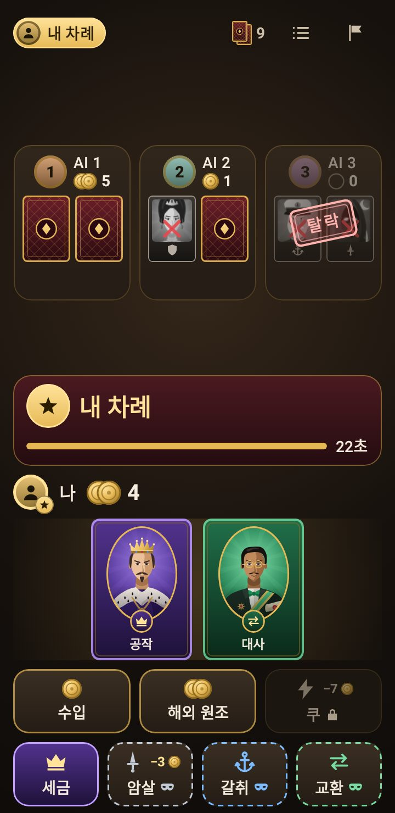 |  | 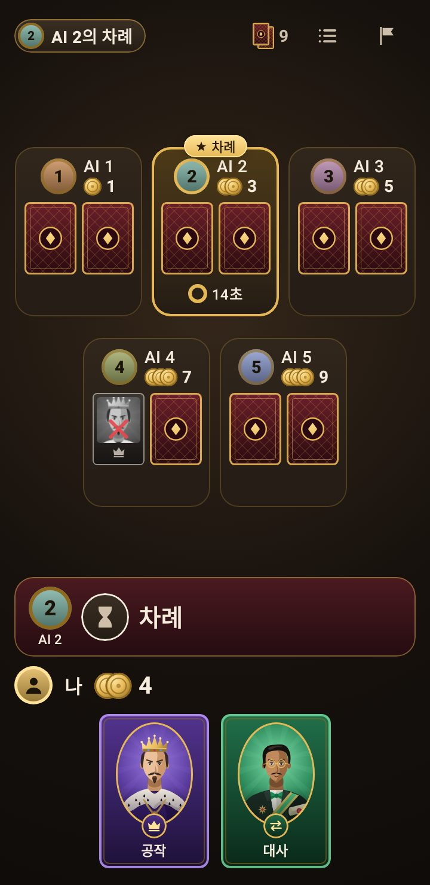 | 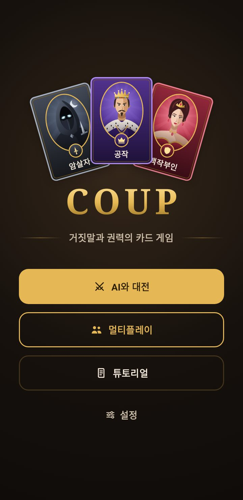 |

## 방향: 촛불 아래의 테이블

- **한 가지 모습.** 어두운 호두나무 테이블, 가운데의 촛불빛, 황동·금 장식, 양피지 글씨. 기기의 밝은/어두운 설정을 따르지 않는다(밝은 테마와 다이내믹 컬러를 없앴다) — 카드·역할 색의 대비를 한 가지 바탕에 맞춘다.
- **테이블에 앉은 순서대로 놓는다.** 위에서 아래로: 표시줄(차례 칩 | 덱·기록·규칙·기권) -> 건너편의 상대들 -> 가운데 판(지금 벌어지는 일) -> 내 카드 -> 내가 누를 것.
  판·내 카드·결정은 항상 보이게 아래에 고정하고, 상대들은 남는 높이의 가운데에 앉는다(넘치면 그 부분만 스크롤).
- **가장 중요한 것이 가장 크다.** 내 카드가 화면에서 가장 큰 그림이고, 그다음이 지금 벌어지는 일과 내가 누를 것이다. 기록은 구석의 버튼 뒤에 둔다.
- **글보다 그림.** 테이블 위의 글은 이름과 한두 낱말("세금", "도전", "내 차례")뿐이다. 누가 누구에게 무엇을 하는지는 얼굴·카드·문양·화살표로 보이고,
  문장은 스크린리더 설명과 기록 창에만 있다(오너 피드백 2026-11-20 "글이 너무 많다").
- **역할마다 색과 문양이 있다.** 공작 보라·왕관, 암살자 강철빛·단검, 사령관 파랑·닻, 대사 초록·맞바꿈, 백작부인 붉은색·방패.
  카드, 행동 칸, 막기 버튼, 주장 표시가 모두 같은 색·문양을 쓴다 — 한 번 익히면 어디서나 읽힌다.
- **진실과 블러핑이 모양으로 갈린다.** 내가 든 역할의 행동·막기는 그 역할 색으로 **채우고**, 블러핑은 **점선 테두리만** 그린다(가면 그림도 함께, 스크린리더에는 "블러핑").

## 색과 글꼴 (`ui/theme`)

- `Color.kt`: 테이블(`TableEdge`/`TableBase`/`TableGlow`), 패널(`PanelLow`..`PanelTop`), 무대의 펠트(`FeltHigh`/`FeltLow`), 금(`Gold`/`GoldBright`/`GoldDeep`), 글씨(`Parchment`/`ParchmentDim`), 붉은색(`Crimson`…), 자리 색(`SeatTints`).
  글씨 두 색은 패널 위에서 대비 7:1 이상이다. 자리(아바타) 색은 역할 색과 헷갈리지 않게 채도가 낮은 흙빛이다.
- `Type.kt`: 제목은 세리프(기기의 명조 계열), 본문·버튼은 고딕. 글꼴 파일을 넣지 않았다.
- `Theme.kt`: Material 3 색 역할을 위 팔레트로 채운다(대화상자·카드·버튼이 따로 손대지 않아도 같은 모습이 된다). 상태 표시줄 아이콘은 밝게.

## 부품 (`ui/kit`)

| 부품 | 하는 일 |
|---|---|
| `TableSurface` | 모든 화면의 바탕. 액티비티가 창 전체(시스템 바 아래까지)에 한 번 그리고, 안쪽 화면은 다시 그리지 않는다. 화면마다 `Surface(color = background)` 대신 쓴다 |
| `Modifier.panel()` / `felt()` | 테이블 위의 판(금색 실선 테두리) / 가운데 판의 붉은 펠트 |
| `Modifier.fadingEdges(scroll)` | 스크롤 영역의 잘리는 가장자리를 흐리게 한다(글자가 반쯤 잘려 보이지 않게). `verticalScroll` **앞에** 붙인다 |
| `PlayingCardFace` / `PlayingCardBack` | 카드. 너비에 비례해 그려서 자리의 작은 카드(36dp)부터 확대 창(228dp)까지 같은 그림이다. 52dp보다 좁으면 얼굴 + 문양만, 넓으면 타원 초상 + 문양 + 이름. `lost`(빛바램 + X), `selected`(금색 테두리) |
| `RoleVisuals` | 역할 ID -> 색·문양·초상. 모르는 역할은 금빛 중립 카드(문양만) |
| `CoupIcons` | 직접 그린 24x24 벡터 문양(왕관, 단검, 닻, 방패, 번개, 칼 …, 표시용 가면·자물쇠·느낌표·기록·과녁·화살). 글꼴·그림 파일이 없다 |
| `CoinIcon` / `CoinPile` | 코인. 더미는 많을수록 겹쳐 보인다(3개부터 두 닢, 7개부터 세 닢) |
| `Avatar` | 플레이어 표식. 이름이 숫자로 끝나면 그 숫자, 아니면 첫 글자 |
| `PrimaryButton` / `SecondaryButton` | 채운 버튼(시작·확정·도전·막기) / 테두리 버튼(허용·취소). 높이 52dp. 좁은 자리에는 안쪽 여백을 줄인다(`contentPadding`) |

### 카드 초상

역할 다섯의 초상은 **이 저장소에서 그린 그림**이다. `tools/card-art/portraits.py`가 도형(경로·그라데이션)으로 그려 Android 벡터 드로어블
(`res/drawable/portrait_*.xml`, 장당 9~15KB)로 내보낸다. 사진이나 남의 그림을 쓰지 않아 출처 문제가 없고, 어느 크기에서도 선명하다.

| 공작 | 암살자 | 사령관 | 대사 | 백작부인 |
|---|---|---|---|---|
| 왕관, 흰 담비 털 깃, 금 사슬 | 두건, 어둠 속에서 빛나는 눈, 복면, 단검, 초승달 | 제모와 닻 휘장, 흰 수염, 금 견장 | 금테 안경, 나비넥타이, 장식 띠와 별 훈장, 두루마리 | 올림머리, 작은 왕관, 귀걸이, 붉은 드레스 |

- 그림판은 300x400(3:4)이고 카드는 그 안의 타원만 보인다. 자리의 작은 카드는 가운데(머리)를 당겨 보이므로 **머리와 모자는 x 60~240, y 60~260 안에** 둔다.
- 빛은 왼쪽 위에서 온다(얼굴 오른쪽이 그늘). 바탕은 역할 색이고 머리 뒤에서 엷은 빛살이 퍼진다.
- 고칠 때는 스크립트의 숫자를 고치고 다시 돌린다. **XML을 직접 고치지 않는다**(다음에 돌리면 덮어쓴다).

```
python3 tools/card-art/portraits.py                  # res/drawable/portrait_*.xml 을 다시 쓴다
python3 tools/card-art/portraits.py --preview DIR    # 확인용 SVG 와 preview.html 도 DIR 에 쓴다(브라우저로 연다)
```

옛 카드 PNG 6장(장당 2~3MB)은 글자가 그림에 박혀 있어 작으면 읽히지 않고 영어에서도 한국어로 보였으며, 그 초상(사진풍)은 출처를 확인할 수 없었다 —
모두 지웠다(git 기록에는 남아 있다). 이름·능력은 글자로 그린다. `CardArtTest`가 초상이 벡터 그림인지 지킨다.

## 게임 화면 (`game/`)

| 파일 | 담당 |
|---|---|
| `GameScreen.kt` | 화면 뼈대(좁은 화면 1단 / 840dp 이상 2단), 대화상자(결과·기권·버려진 판), 연결 배너, 튜토리얼 안내 |
| `GameTable.kt` | 표시줄, 상대 자리(들어 보인 주장 카드), 기록·기록 창 |
| `GameStage.kt` | 가운데 판: 진행 배너 -> 그림 장면(응답 시트 머리와 극적인 순간의 띠도 같은 그림 조각을 쓴다) |
| `GameHand.kt` | 내 자리·손패, 카드 확대 |
| `GameDecision.kt` | 행동 칸, 대상 고르기, 카드 확정, 응답 시트 |
| `GameFx.kt` | 연출(뒤집기·코인·맥박·시트 등장), 남은 시간(링/막대) |
| `Moments.kt` / `MomentFx.kt` | 극적인 순간: 무엇이 순간인가·대기열·무대 / 컷인 띠, 탈락 도장, 붉은 번쩍임, 승리 연출 |
| `Pacing.kt` | 판이 극적인 순간을 기다렸다가 따라가게 한다(결과가 먼저 보이지 않게) |
| `ActionFx.kt` | 누가 누구에게: 자리 위치, 행동 화살표 |
| `CoinFx.kt` | 날아가는 코인: 코인 변화 -> 이동(은행↔자리, 갈취는 자리→자리), 날리기, 그림 |
| `Josa.kt` | 한국어 조사 고르기("AI 2이(가)" -> "AI 2가", "나이(가)" -> "내가") |

- **상대 자리**: 옆으로 밀지 않아도 모두 보이게 줄을 나눈다(1~3명 한 줄, 4명 2x2, 5명 3+2; 화면이 좁으면 줄을 늘린다). 지금 움직이는 사람은 금색 테두리가 맥박친다.
  높이가 남으면 자리의 **카드가 커진다**(기본 50dp, 최대 84dp — 자리 너비에 두 장이 들어가는 만큼; `seatCardHeight`). 공개된 카드의 초상이 잘 보이게 한다.
  역할을 주장하는 동안에는 그 역할 카드를 **카드들 위로 크게 들어 보인다**(역할 색으로 빛나고 기울어져 튀어나온다, 자리 크기는 그대로). 글로 쓰지 않는다 — 스크린리더에는 "공작 주장".
  상태 줄도 그림이다: 행동·생각 중이면 남은 시간 고리(제한이 없으면 모래시계), 응답했으면 체크.
- **누구의 차례**: 이 턴의 주인(`GameUiState.turnPlayer` — 응답·도전 중에도 그대로다) 자리에 금색 **"★ 차례" 탭**이 걸치고 판이 금빛으로 테두리진다.
  내 차례면 내 아바타에 **금색 별**이 붙고 손패 뒤로 금빛이 번지며, 가운데 판이 "★ 내 차례"를 크게 보인다. 맨 위 표시줄에는 늘 **"AI 2의 차례" / "내 차례" 칩**이 있다.
  대상을 고르는 중에는 고를 수 있는 **자리를 눌러서** 고를 수 있다(이름 버튼도 그대로 있다).
- **가운데 판**: 아래 "가운데 판" 절. 내 결정의 남은 시간은 막대로 붙는다.
- **응답할 차례**: 응답 시트 하나에 남은 시간·상황·버튼이 모인다(가운데 판은 그동안 접힌다). 시트 머리는 **판과 같은 그림 장면**이다.
  허용은 테두리만, 도전은 붉은색, 막기는 역할 색(블러핑이면 테두리만 + 방패 대신 가면).
- **행동 칸**: 글은 이름 하나뿐이다. 주장하는 역할은 문양과 색으로, 드는 코인은 "−3 코인"으로, 못 하는 이유(자물쇠)·필수(느낌표)·블러핑(가면)은 이름 뒤의 작은 그림으로 보인다 —
  스크린리더에는 이름부터 "세금, 공작", "갈취, 사령관, 블러핑", "쿠 (-7), 코인 부족"처럼 읽힌다.
- **손패**: 상태 글자("선택됨" 등)를 없앴다. 고른 카드는 올라오며 금테, 증명하는 카드는 금색 체크, 잃은 카드는 흐리고 X — 스크린리더에는 "공작 (선택됨)".
- **기록**: 폰에서는 테이블에 없다. 표시줄 구석의 **기록 버튼**(목록 그림)을 누르면 창으로 뜨고, 가장 최근 일이 맨 위에 크게 나온다. 몇 번째 턴인지는 기록의 머리에 있다.
  기록 창도 보이는 판을 따른다(연출 중에 열어도 결과를 미리 말하지 않는다). 840dp 이상의 넓은 화면은 옆 단에 기록이 늘 있다(기록 버튼이 없다).
- **표시줄**: 차례 칩 하나만 글이고, 덱(카드 뒷면 + 장수)·기록·기권(깃발)은 그림이다. 그림 버튼의 누르는 영역은 48dp이고 스크린리더에는 이름이 읽힌다.
- **낮은 화면**(620dp 미만): 내 카드와 판의 그림을 줄이고, 남은 시간 막대를 판의 장면 옆에 붙인다.

## 가운데 판

지금 벌어지는 일을 **그림 한 줄**로 보인다(`StagePanel` / `SceneRow`): **[누가] [무슨 카드/문양] [무엇을 · +코인 · 기다리는 얼굴] → [누구에게]**.
글은 한두 낱말("세금", "막기", "도전")뿐이고, 스크린리더에는 진행 문장 전체와 기다리는 사람이 읽힌다(`spokenScene`).

| 공작 세금(+3)에 응답 | 사령관 갈취에 응답 | 기록 창 |
|---|---|---|
| 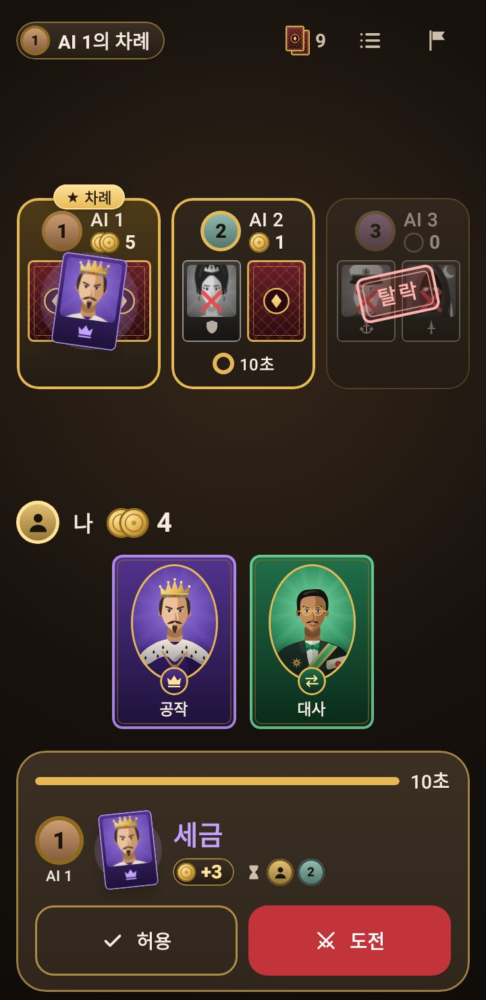 | 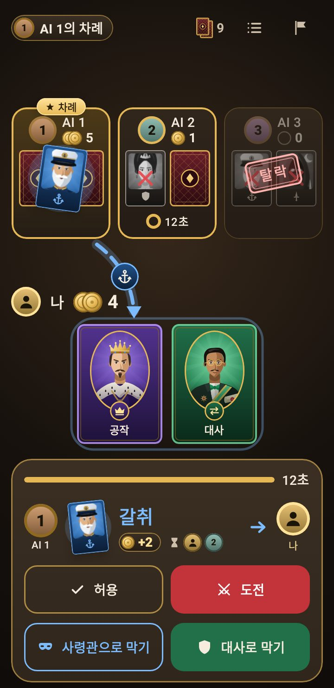 | 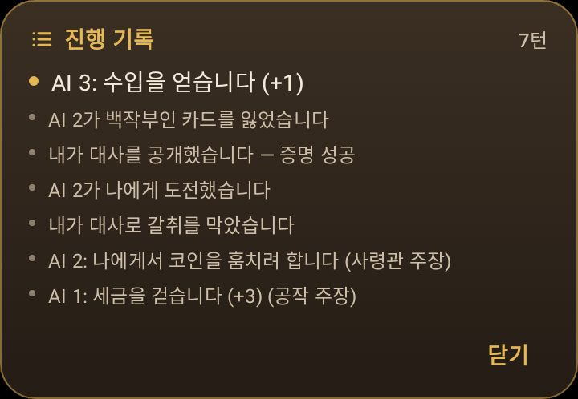 |

| 진행 | 장면 |
|---|---|
| 내 차례 | 금색 별, "내 차례"(쿠만 할 수 있으면 번개) |
| 다른 사람의 차례 | [그 사람] 모래시계 "차례" |
| 역할을 주장한 행동 | [행동한 사람] **그 역할 카드**(역할 색으로 빛남) "세금" **+3 코인** — 대상이 있으면 → [대상] |
| 역할 없는 행동 | 수입 = 코인 한 닢, 해외 원조 = 코인 더미, 쿠 = 붉은 번개 |
| 막기 | [막는 사람] 그 역할 카드 "막기" → [행동한 사람] |
| 도전 | [도전자] 붉은 칼 "도전" → [주장한 사람] [의심받는 카드 ?] |
| 카드 잃기 / 교환 / 끝 | [그 사람] X "카드 잃기" / 대사 카드 "교환" / 왕관 "승리" |

- 얻는 코인(+1/+2/+3, 갈취 +2)은 **표준 규칙일 때만** 붙인다 — 규칙이 바뀐 판에서는 숫자가 틀릴 수 있다.
- 아직 응답하지 않은 사람은 낱말 아래에 모래시계와 작은 얼굴로 보인다.
- 장면이 바뀌면 새 장면이 아래에서 올라온다(같은 장면에서 기다리는 사람만 줄면 움직이지 않는다).
- 응답 시트의 머리와 극적인 순간의 띠도 같은 그림 조각(`Figure`, `MarkedCard`)을 쓴다.

## 행동이 보이는 테이블

누가 누구에게 무엇을 하는지 글을 읽지 않아도 보이게, 테이블 위에 **화살표**를 그린다(`ActionArrows`). 진행 배너가 말하는 것을 그대로 잇는다.

| 진행 | 화살표 | 실려 가는 문양 |
|---|---|---|
| 대상이 있는 행동(갈취·암살·쿠) | 행동한 자리 -> 대상 자리(나면 내 손패) | 주장한 역할의 문양(닻·단검), 쿠는 붉은 번개 |
| 막기 | 막는 자리 -> 행동한 자리 | 그 역할 색의 방패 |
| 도전 | 도전하는 자리 -> 주장한 자리 | 붉은 칼 |

- 화살표는 역할 색의 **흐르는 점선**이라 방향이 한눈에 보이고, 대상 자리는 테두리가 맥박친다. 처음 나타날 때 행동한 자리에서 대상 쪽으로 뻗어 간다.
- 위아래로 떨어진 자리는 마주 보는 테두리를 곡선으로 잇고, **같은 줄에 나란히 앉은 자리끼리는 자리 아래로 크게 휘어** 돌아간다(그대로 이으면 너무 짧아 보이지 않는다).
- 자리의 위치는 `TableAnchors`가 적어 둔다(자리·내 손패가 놓일 때마다). 다음 작업인 날아가는 코인도 이 위치를 쓴다.
- 화살표는 **가운데 판 아래로 지나간다**: 판이 놓인 곳(`TableAnchors.stage`)은 그리지 않아 판의 그림·글을 가리지 않는다. 곡선 가운데의 문양이 판에 묻히면 판 밖의 가장 가까운 곳으로 옮긴다(`discPoint`).
- 대상이 없는 행동(수입·해외 원조·세금·교환)에는 화살표가 없다 — 들어 보인 카드와 가운데 판(+코인)이 알린다.
- 그림일 뿐이라 누르는 것을 가로채지 않는다. 연출이 꺼져 있어도 화살표는 그린다(정보이므로) — 움직이지만 않는다.

## 코인이 날아간다

| 세금(은행 -> 나) | 갈취(나 -> AI 1) |
|---|---|
| 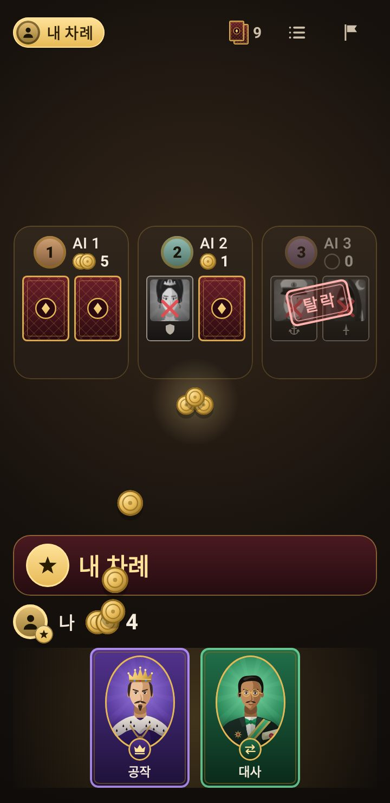 | 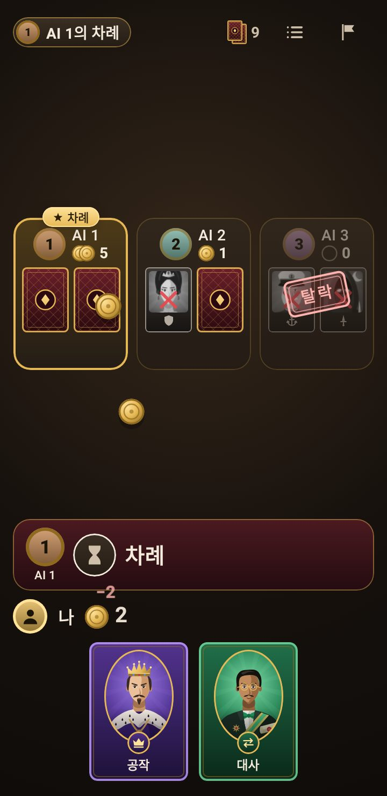 |

코인이 움직이면 코인 그림이 테이블 위를 날아간다(`CoinOverlay`). 엔진의 코인 변화 신호(`UiEffect.CoinsChanged`)를 이동으로 바꾼다(`CoinDirector`).

- **어디서 어디로**: 얻으면 **은행**에서 오고(수입·해외 원조·세금), 내면 은행으로 간다(암살·쿠의 값). 한 사람이 잃고 바로 다른 사람이 같은 만큼 얻으면
  **자리에서 자리로** 간다(갈취) — 잃음은 짝이 될 얻음을 0.06초 기다린다. 은행은 테이블 한가운데(화면 가운데)로, 코인이 오가는 동안만 금화 더미가 빛난다.
  끝점은 그 사람의 코인 더미(`TableAnchors.purse`)다.
- **모습**: 닢마다 코인 하나(많으면 다섯 개에 나눠 싣는다)가 0.11초 간격으로 떠나 0.56초 동안 휜 길로 날고, 닿으면 금빛 고리가 퍼진다.
  받는 사람 옆에는 "+3", 내는 사람 옆에는 "−7"이 떠올랐다 사라진다.
- **숫자는 코인이 닿을 때 오른다**: 화면의 코인 숫자는 아직 떠나지 않은 코인은 보낸 사람에게, 아직 닿지 않은 코인은 받는 사람에게서 빼고 보인다 —
  세금이면 4 -> 5 -> 6 -> 7로 하나씩 오른다. 스크린리더에는 언제나 지금 값이 읽히고, 버튼(쿠를 할 수 있는지 등)도 지금 값을 따른다.
- **극적인 순간 뒤에 난다**: 띠가 그 일을 말하는 동안에는 코인이 날지 않고 숫자도 그대로다(먼저 날면 "갈취가 통했다"를 미리 말해 버린다). 띠가 지나가면 난다.
- **소리**: 코인 소리는 코인이 처음 닿을 때(은행으로 갈 때는 떠날 때) 난다. 연출이 꺼져 있으면 코인이 날지 않고 숫자·소리가 바로 바뀐다.
- 결과 화면이 뜨면 남은 코인은 날리지 않는다.

## 극적인 순간


판을 흔드는 사건은 화면 가운데를 가로지르는 띠(격투 게임의 "컷인")로 잠깐 크게 알린다. 상태는 이미 바뀌어 있고(자리·판·기록에도 나온다) 이것은 그 위에 덧입히는 연출이다.
띠의 글은 외치는 한 마디뿐이고, 무슨 일인지는 **그림 한 줄**(얼굴·카드·✓/✗)로 보인다.

| 순간 | 언제 | 모습 | 그림 한 줄 | 보통 속도 |
|---|---|---|---|---|
| 도전 | 누군가 도전했다 | 붉은 칼 문장, "도전!" | [도전자] 칼 → [주장한 사람] [의심받는 카드 ?] | 1.15초 |
| 증명 / 거짓말 | 도전받은 사람이 카드를 뒤집었다 | 카드가 크게 뒤집힌 **뒤에** 판정이 도장처럼 찍히고, 그다음에 그림이 나온다(먼저 나오면 결과를 미리 말해 버린다). 거짓말은 띠가 흔들린다 | [공개한 사람] [주장 카드 ✓/✗] → (증명이면 [도전자]) [잃는 카드 ✗] | 2초 |
| 막기 | 막기 선언 | 그 역할 색의 방패, "막기!" | [막는 사람] [역할 카드] 방패 [막는 행동의 문양] | 1.15초 |
| 쿠 | 쿠 선언(막을 수도 도전할 수도 없는 일격) | 붉은 번개, "쿠!" | [행동한 사람] 번개 → [대상] | 1.25초 |
| 탈락 | 누군가 마지막 카드를 잃었다 | 아바타에 붉은 X, "탈락!" 도장. 나면 "탈락했습니다" | 이름 | 1.6초 |

- **신호**: 게임 코어의 연출 신호(`GameController.effects` -> `UiEffect`)를 쓴다(설계 §10.3 "상태는 즉시, 애니메이션은 이벤트로"). 행동 선언·막기·도전 신호를 이번에 더했다.
  `MomentDirector`가 신호를 순간으로 바꾸고(도전 내용을 기억해 뒤따르는 공개에 붙인다), `MomentStage`가 하나씩 무대에 올린다.
- **밀려올 때**: 빠른 AI끼리의 공방이나 다시 연결된 직후처럼 한꺼번에 오면, 기다리는 것은 2개까지만 남긴다(넘치면 가장 가벼운 것 — 막기 < 도전·쿠 < 공개·탈락, 같으면 오래된 것 — 을 버린다). 연출이 판보다 한참 뒤처지지 않게 한다.
- **누르는 것을 막지 않는다**: 띠는 그림일 뿐이라 그 아래의 버튼은 그대로 눌린다. 띠의 그림에는 같은 뜻의 문장(`GameTexts.moment`)이 설명으로 달려 있지만
  저절로 읽히지는 않는다(같은 일을 판·기록이 이미 알린다 — 두 번 읽히지 않게).
- **판이 끝날 때**: 마지막 순간(마지막 탈락 등)이 지나간 뒤에 결과 화면을 띄운다(최대 약 3.6초, 뒤로 가기를 누르면 바로). 결과 화면은 이기면 왕관이 튀어 오르며 빛살이 돌고 금화와 불꽃이 터지고, 지면 X 문장이 떨어져 내려앉는다.
- **탈락 도장**: 탈락한 자리(내 손패 포함)에 "탈락" 도장이 찍힌다. 탈락하는 순간을 봤으면 크게 떨어지며 찍히고, 처음부터 탈락해 있었으면 그냥 찍혀 있다. 도장은 **상태**라서 연출이 꺼져 있어도 보인다.
- **내 카드를 잃을 때**: 화면 가장자리가 붉게 번쩍이고 내 자리가 흔들리며 진동이 온다. 진동은 기기의 터치 진동 설정을 따르고, 연출 설정과 상관없이 온다.
- **연출이 꺼져 있으면**: 띠·번쩍임·흔들림·결과 연출이 모두 없고 결과는 바로 뜬다.

### 판이 기다린다

남은 카드가 1장인 사람에게 도전하거나 쿠를 하면 엔진은 고를 것이 없어 도전·공개·탈락을 **한 번에** 처리하고, 세션은 바뀐 상태를 연출 신호보다 **먼저** 알린다.
그대로 그리면 띠가 "도전!"을 외치는 동안 자리에 벌써 탈락 도장이 찍혀 결과를 미리 말해 버린다(오너 피드백 2026-11-19).

그래서 **보이는 판**(자리의 카드·생사, 내 손패, 진행 문구, 기록)은 극적인 순간이 다 보일 때까지 기다렸다가 따라간다(`rememberPacedBoard`).

- 바뀐 상태는 먼저 잠깐(0.12초) 익힌다 — 그 변화를 설명할 연출 신호가 뒤따라 올 수 있다.
- 순간이 다루는 사람(`Moment.involves`: 도전한 사람·도전받은 사람, 쿠의 대상, 탈락한 사람)의 카드와 생사는 그 순간들이 끝날 때까지 그대로 둔다.
  **그 사람의 "탈락!" 띠가 오르는 순간 놓아준다** — 띠의 도장과 자리의 도장이 함께 찍힌다.
- 순간이 무대에 있는 동안에는 진행 문구·기록·**차례 표시**도 그대로 두었다가, 무대가 비면 따라간다(띠가 지난 턴의 일을 말하는 동안 다음 사람이 차례로 보이지 않게).
- **결정·남은 시간·코인·버튼·결과는 기다리지 않는다**(`BoardPacing.withLive`) — 사람이 반응해야 하는 것은 언제나 지금 상태다.
- 효과음도 보이는 판을 따른다(탈락 소리가 띠의 "탈락!"과 함께 난다).
- **AI도 기다린다**(싱글플레이·튜토리얼): 화면이 순간을 보여 주는 동안에는 AI가 다음 수를 두지 않는다 — 그렇지 않으면 띠가 지난 일을 말하는 동안
  다음 AI가 벌써 움직여, 응답 버튼은 새 행동을 묻는데 판은 지난 이야기를 보여 주게 된다. 게임 화면이 무대가 바쁜지 알리고(`onStageBusy`),
  `GameViewModel.awaitStage`가 AI의 제출 직전에 기다린다(최대 6초, 끝난 뒤 0.35초 숨 고름; 코어의 `AiSeat(awaitStage)`). 멀티플레이 상대는 사람이라 해당하지 않는다.
- 연출이 꺼져 있으면 판도 AI도 기다리지 않는다.

## 멀티플레이 화면 (`multiplayer/`)

| 로그인 | 홈의 내 프로필 | 로비 | 방 만들기 |
|---|---|---|---|
| 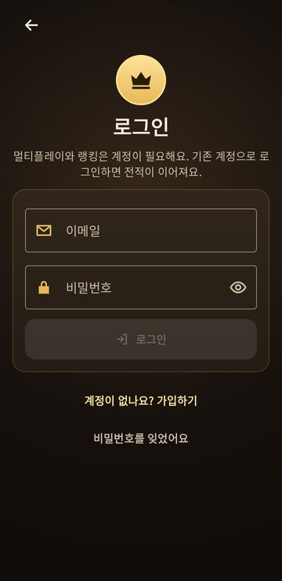 | 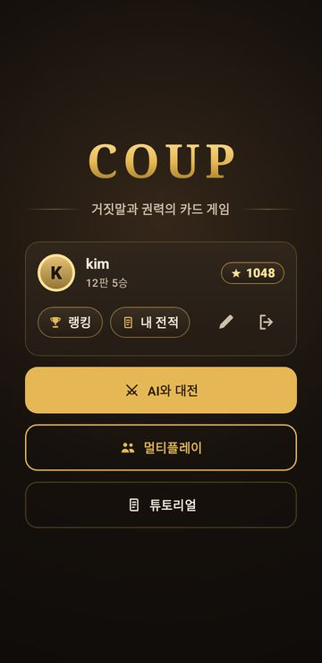 | 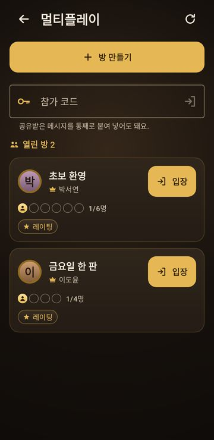 | 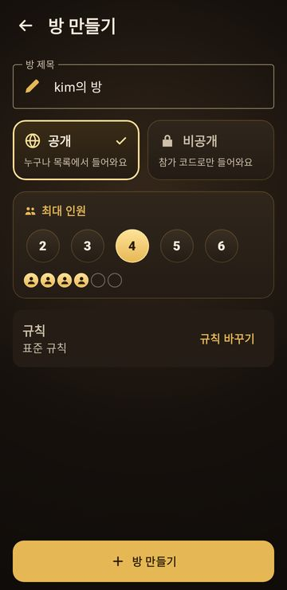 |

| 대기실(방장) | 대기실(손님) | 랭킹 | 내 전적 |
|---|---|---|---|
| 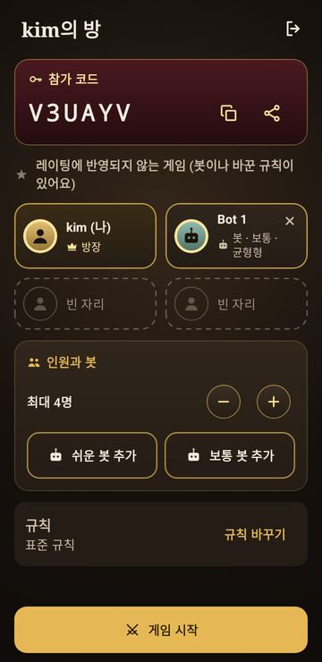 | 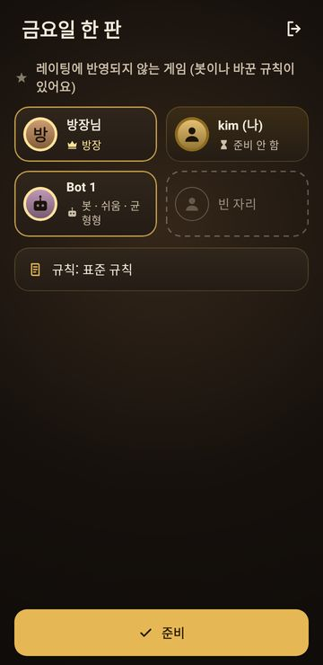 | 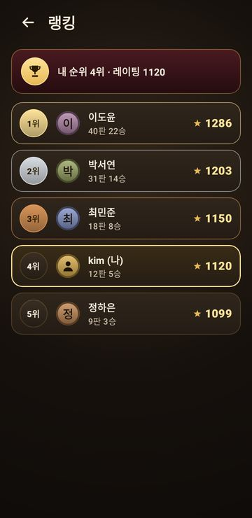 | 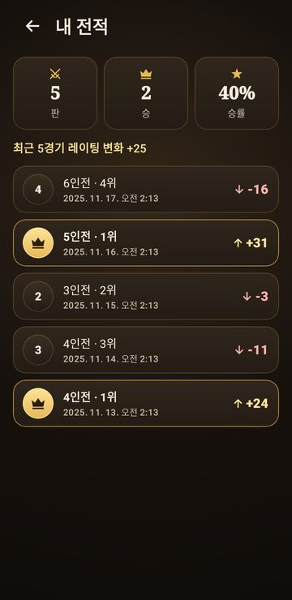 |

게임 화면과 같은 테이블 모습으로 맞췄다(2026-11-25). 공통 부품은 `MpKit.kt`에 있다.

| 부품 | 하는 일 |
|---|---|
| `ScreenBar` | 맨 위 줄: 뒤로(화살 그림 버튼), 세리프 제목, 오른쪽 그림 버튼(새로고침·나가기). 그림 버튼의 이름은 스크린리더가 읽는다 |
| `Section` | 판 하나로 묶은 구역과 금색 작은 머리(그림 + 이름) |
| `NoticeBar` | 문제(붉은 판, 느낌표)·안내(금색, 두루마리) 띠. 한 덩어리로 읽히고 바뀌면 읽어 준다 |
| `IconChip` | 그림과 짧은 낱말의 표(레이팅 별, 봇, 바꾼 규칙) |
| `SeatDots` | 자리 표: 앉은 자리는 금색 사람, 빈 자리는 점선 동그라미("1/6명"으로 읽힌다) |
| `EmptyState` | 빈 목록: 큰 그림과 한 줄 |
| `StepButton` | 둥근 −/+ 그림 버튼(최대 인원) |

- **로그인·가입**: 왕관 메달과 세리프 제목, 그림이 붙은 입력 칸(편지·자물쇠), 비밀번호 보기는 칸 끝의 눈 그림이다. 실패·재설정 안내는 띠로.
- **홈의 내 프로필**: 얼굴(첫 글자), 닉네임과 판·승, 오른쪽에 별과 레이팅. 랭킹(트로피)·내 전적(두루마리) 알약 버튼, 구석에 고치기(연필)·로그아웃(나가기) 그림.
  스크린리더에는 머리가 "kim · 레이팅 1048"로 읽힌다.
- **로비**: 방 만들기(+), 열쇠 그림의 참가 코드 칸(끝의 입장 그림으로 들어간다), 열린 방 판들 — 방장 얼굴과 왕관, 앉은 자리 표, 레이팅·봇·바꾼 규칙 표, 입장 버튼(자리가 다 찼으면 잠긴다). 빈 목록은 큰 그림으로.
- **방 만들기**: 제목 칸, 공개(지구)/비공개(자물쇠) 두 판, 최대 인원은 숫자 동그라미와 그만큼 켜지는 자리 표, 규칙. 만들기 버튼은 맨 아래에 고정된다.
- **대기실**: 맨 위에 방 제목과 나가기(그림). 비공개 방은 붉은 펠트의 **참가 코드 표**(큰 글자, 복사·공유 그림 버튼). 레이팅 표(별), 그리고
  **자리 타일** 두 줄씩 — 얼굴(봇은 로봇, 나는 금색 사람), 이름("(나)"), 상태 한 줄(방장 왕관 / 봇 / 준비 완료 체크 / 준비 안 함 모래시계).
  방장 자리와 준비한 자리는 금색 테두리, 빈 자리는 점선이다. 방장에게는 "인원과 봇"(−/+, 봇 넣기)과 규칙, 손님에게는 규칙 한 줄.
  **시작·준비 버튼은 맨 아래에 고정**되고, 시작할 수 없으면 그 이유가 버튼 위에 나온다.
- **랭킹**: 맨 위 붉은 펠트에 내 자리(트로피), 그 아래 순위 줄 — 1~3위는 금·은·동 메달, 얼굴, 이름과 판·승, 별과 레이팅. 내 줄은 금빛이 돈다.
- **내 전적**: 판·승·승률 세 칸(스크린리더에는 "5판 2승 · 승률 40%" 한 문장), 최근 레이팅 변화, 판마다 한 줄 — 1위는 왕관, 몇 인전 몇 위, 날짜, 오르내린 레이팅(화살표와 색).
- **스크린샷**: `MpGalleryTest`가 가짜 서버 위에서 이 화면들을 그린다(`-Pscreenshots`, 아래 "스크린샷 모음").

## 지켜야 할 것

1. **색만으로 전하지 않는다.** 블러핑(가면)·필수(느낌표)·잠긴 이유(자물쇠)·선택됨(올라옴 + 금테)·잃은 카드(X)·탈락(도장)은 모양으로도 나오고, 스크린리더에는 글로 읽힌다.
2. **누르는 영역은 48dp 이상.** 자리의 작은 카드(36dp)도 누르는 상자는 48dp다.
3. **연출은 `LocalMotion`을 따른다.** 꺼져 있으면(설정 "끄기", 기기의 애니메이션 없음) 즉시 끝난 모습이어야 한다. 상태는 연출과 상관없이 이미 바뀌어 있다.
4. **계속 도는 연출은 그리는 단계에서만 값을 읽는다**(`drawWithContent`, `graphicsLayer { }` 안). 구성 단계에서 읽으면 매 프레임 화면을 다시 구성한다.
5. **카드 안의 글자는 그림이다.** 카드 크기에 맞춰 그리고 접근성 트리에 내지 않는다 — 이름은 부르는 쪽이 `semantics`로 알린다.
6. **테스트 태그(`GameTags`…)와 스크린리더 설명은 약속이다.** 모습을 바꿔도 태그·설명("코인 N", "덱 N장", 카드 이름, 판의 진행 문장, "공작 주장")은 남긴다.
   글을 그림으로 바꾸면 그 글은 설명(`contentDescription`)으로 옮긴다.
7. **작은 화면(320x568dp)과 큰 글씨(1.6배)에서 눌러야 하는 것이 스크롤 없이 보여야 한다** — `GameScreenTest`가 그 조건으로 끝까지 둔다.
8. **테이블에 문장을 쓰지 않는다.** 이름과 한두 낱말만 쓰고, 문장은 스크린리더 설명·기록 창·대화상자에 둔다.

## 스크린샷 모음

기기 없이 실제 렌더링으로 주요 화면의 PNG를 만든다(`ScreenshotGalleryTest`, 멀티플레이는 `MpGalleryTest`, Robolectric 네이티브 그래픽). 평소 테스트에서는 건너뛴다.

```
./gradlew :app:testDebugUnitTest --tests '*ScreenshotGalleryTest*' -Pscreenshots=          # app/build/screenshots/
./gradlew :app:testDebugUnitTest --tests '*ScreenshotGalleryTest*' -Pscreenshots=/어떤/폴더
```

새 화면이나 상태를 만들면 여기에 한 장 더한다. 글꼴은 기기와 다를 수 있다(이 환경에는 한글 명조가 없어 한글 제목이 고딕으로 나온다 — 기기에서는 명조로 보인다).

## 아직 하지 않은 것

- **실기기 확인이 필요한 것**: 한글 세리프 제목의 실제 모습(기기 글꼴), 맥박·판 전환·극적인 순간 연출의 체감과 속도, 진동의 세기, 시스템 바 아래 배경, 큰 화면(태블릿) 2단 배치의 균형,
  그림만으로 처음 하는 사람이 행동 칸·막기 버튼·판의 장면을 알아보는지(오너가 ADB 기기로 직접 돌려 보자고 했지만, 이 작업 환경에서는 오너의 컴퓨터에 닿지 못해 아직 못 했다).
- 진동 켜기/끄기 설정(지금은 기기의 터치 진동 설정을 따른다).
