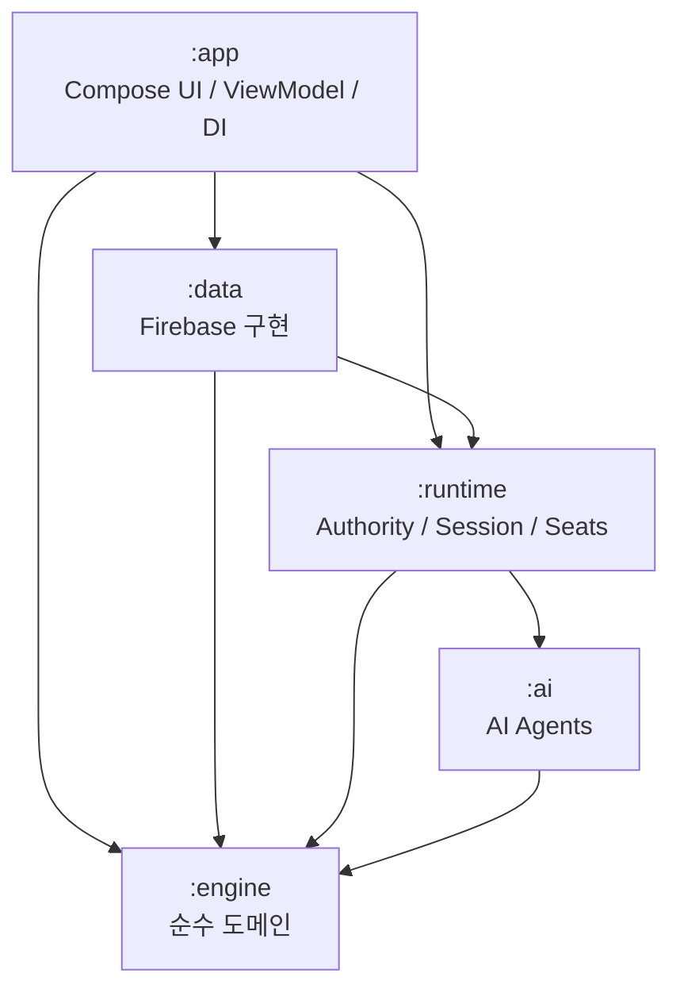
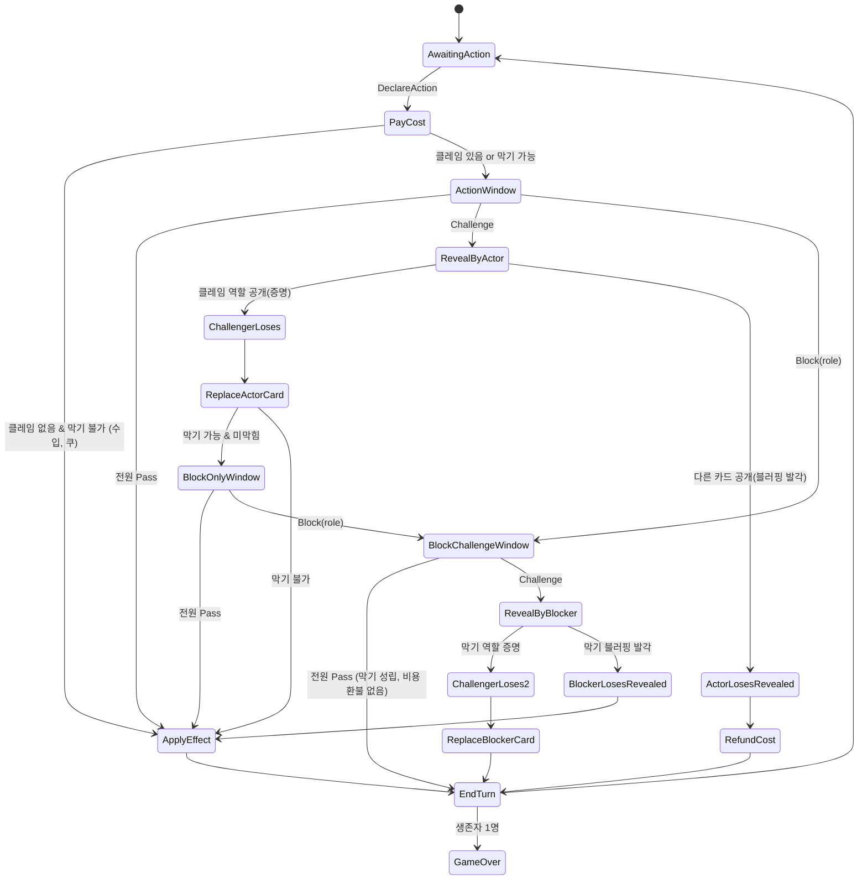
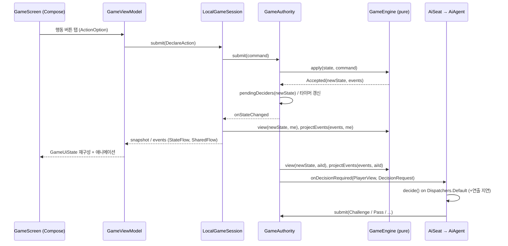
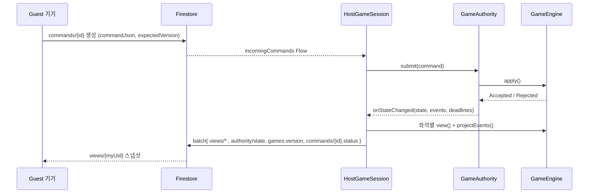
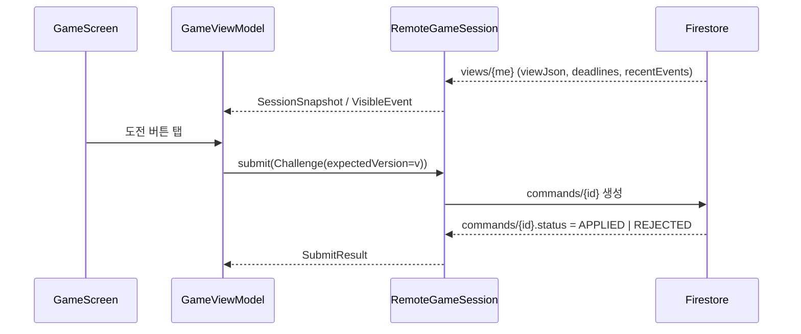
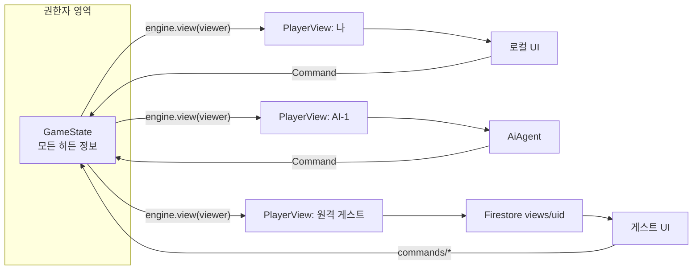

# Coup 리팩토링 & 업그레이드 — 아키텍처 설계 명세서

> **대상 독자**: 이 문서를 받아 실제 구현을 진행할 모델(Sonnet) 및 프로젝트 오너.
> **성격**: 설계 명세서입니다. 코드는 포함하지 않으며, 인터페이스는 **시그니처 수준**(이름·입출력 타입·책임)까지만 정의합니다. 함수 본문은 구현자가 작성합니다.
> **분석 기준 커밋**: `9f6c14f` (튜토리얼 수정) — 전체 51커밋, Kotlin 소스 약 4,900줄.

---

## 0. 이 문서를 읽는 법 (구현자용)

| 섹션 | 언제 읽나 |
|---|---|
| §1 현재 상태 분석 | 맨 처음 1회. 기존 코드가 "왜" 버려지는지 이해 |
| §2 목표 아키텍처 원칙 | 모든 작업 전에. 원칙을 어기는 구현은 거절 대상 |
| §3 모듈 구성 | Phase 0 (빌드 설정) 작업 시 |
| §4 게임 엔진 | Phase 1 — 가장 중요. 시그니처를 그대로 따를 것 |
| §5 룰/역할 확장 모델 | Phase 1 후반 + 신규 역할 추가 시 |
| §6 런타임(세션/권한자) | Phase 2 |
| §7 AI | Phase 2~6 |
| §8 멀티플레이어 & 데이터 | Phase 4 |
| §9 데이터 흐름도 | 각 Phase에서 흐름 확인용 |
| §10 UI 현대화 | Phase 3, 5 |
| §11 기술 부채 현재화 | Phase 0, 5 |
| §12 테스트 전략 | 모든 Phase (테스트 없는 PR 금지) |
| §13 마이그레이션 로드맵 | 작업 순서 결정 시. **각 Phase의 DoD 준수** |
| §14 리스크 | 설계 판단이 애매할 때 |
| §15 오너 결정 사항(확정) | 구현 전 반드시 확인 |
| §16 모델 전환(Opus↔Sonnet) 운영 규칙 | 작업 인계/재개 시 |

용어:
- **영향력(Influence)**: 플레이어가 가진 카드 1장. 공개(revealed)되면 잃은 것.
- **클레임(Claim)**: "나는 X 역할을 가지고 있다"는 선언(행동 또는 막기 시).
- **권한자(Authority)**: 진짜 `GameState`(비공개 정보 포함)를 보유하고 엔진을 실행하는 주체.
- **뷰(PlayerView)**: 특정 플레이어 시점으로 비공개 정보를 제거한 상태 사본.

---

## 1. 현재 상태 분석

### 1.1 기술 스택

| 항목 | 현재 값 | 비고 |
|---|---|---|
| 언어 | Kotlin 1.7.20 (kotlin-bom 1.8.0 혼재) | JVM target 1.8 |
| 빌드 | Gradle 8.0 / AGP 8.0.2, **Groovy DSL**, 버전 카탈로그 없음 | 단일 모듈 `:app` |
| SDK | compileSdk 34 / targetSdk 33 / minSdk 24 | targetSdk가 Play 정책 미달 |
| applicationId | `com.example.coup` | **Play 스토어 등록 불가 패키지명** |
| UI | XML View + `findViewById` (ViewBinding 옵션만 켜져 있고 미사용). Compose 의존성/플러그인 활성화되어 있으나 실사용 0 (테마 파일만 존재) | Compose BOM 2022.10.00, compiler ext 1.3.2 |
| 아키텍처 | Activity/Fragment가 직접 Firebase 호출. ViewModel은 Android Studio 로그인 템플릿 잔재(`LoginViewModel`, `LoginRepository`)뿐이며 실제로 사용되지 않음 | DI 없음 |
| 비동기 | Firebase `Task` 콜백 + `CoroutineScope(Dispatchers.IO).launch`(스코프 누수) + `Handler.postDelayed` + **메인 스레드 `Thread.sleep`** | |
| 백엔드 | Firebase Auth(이메일/Google), Firestore(게임 상태 전부), Storage(프로필 이미지). RTDB 의존성은 있으나 인스턴스만 생성하고 미사용 | Firebase BOM 32.3.1 + 개별 버전 고정 혼용, `-ktx` 아티팩트 사용 |
| 로그인 | 레거시 `GoogleSignIn` + `startActivityForResult` | 둘 다 deprecated |
| 이미지 | Glide 4.12 (`annotationProcessor` — Kotlin 프로젝트에서 무의미), CircleImageView | |
| 기타 미사용 의존성 | `firebase-ui-auth`, `firebase-ui-firestore`, `firebase-database`, `play-services-base` 등 | |
| 보안 규칙 | 저장소에 `firestore.rules`/`firebase.json` **없음** | 콘솔에서만 관리되는 것으로 추정 |

### 1.2 프로젝트 구조와 레이어 분리 상태

```
app/src/main/java/com/example/coup/
├── MainActivity.kt            (스플래시: 1.5초 딜레이 후 Login으로)
├── ui/login/*                 (Login/Register/ResetPassword + 사용되지 않는 템플릿 ViewModel)
├── data/*                     (Android Studio 로그인 템플릿 잔재 — 미사용)
├── HomeActivity.kt            (하단 탭 + 재접속 시 진행중 게임 복귀 로직)
├── room_list.kt / ranking.kt / info.kt   (Fragment, 소문자 클래스명)
├── CreateRoomDialog.kt / RoomOptionDialog.kt(TODO만 있음) / GameRuleDialog.kt
├── GameWaitingRoomActivity.kt (686줄: 대기실 + 덱 생성/카드 분배 + 게임 문서 생성)
├── GameRoomActivity.kt        (1882줄: ★ 게임 로직 전부 + UI + Firestore 동기화)
├── GameResultActivity.kt      (273줄: 결과 표시 + 레이팅 계산/기록)
├── Tutorial.kt                (이미지 9장 넘기기)
├── FirestoreSetting.kt / FirebaseSetting.kt (싱글톤 래퍼)
└── ForcedTerminationService.kt (사실상 아무 일도 안 함: 2초 sleep)
```

**레이어 분리: 사실상 없음.** 도메인 레이어, 저장소(Repository) 레이어, 상태 홀더(ViewModel)가 존재하지 않고, Activity가 UI·게임 규칙·네트워크·상태 저장을 모두 담당합니다.

**God Activity — `GameRoomActivity` (1882줄)** 의 책임 목록:
1. 뷰 바인딩 (6명 × 10여 개 뷰를 `findViewById`로 수동 배열화, ~150줄)
2. Firestore 문서 5개(`_INFO/_CARD/_COIN/_ACCEPT/_ACTION`) 리스너 관리
3. 턴 진행, 행동 해석, 도전/막기 판정, 카드 제거, 카드 교체, 교환, 게임 종료 판정
4. 순위 기록(트랜잭션), 게임 문서 삭제(방장만, 3초 딜레이)
5. 바텀시트 7종의 표시 상태 결정(`actionButtonSetting(0..6)` 매직 넘버)
6. 다이얼로그 타이머(`CountDownTimer`)

**UI가 곧 상태 저장소**인 지점들 (가장 심각한 결합):
- 코인 값을 `mPlayerCoin[i].text.toString().toInt()`로 **TextView에서 읽어** 계산 후 Firestore에 씀 (`income()`, `tax()`, `steal()`, `assassinate()` 등). 리스너 반영 전 읽으면 Lost update 발생.
- 바텀시트에 표시할 수 있는 행동이 있는지를 `View.visibility`로 판단.

### 1.3 게임 룰 구현 방식

**모든 규칙이 정수 매직 넘버 + `if/when` 분기로 하드코딩**되어 있습니다.

| 개념 | 현재 인코딩 | 문제 |
|---|---|---|
| 역할 | `1=공작, 2=귀부인(Contessa), 3=사령관(Captain), 4=암살자, 5=외교관(Ambassador)` | 역할 = 한 자리 숫자 |
| 사망 카드 | `원래값 × 10` (예: 30 = 죽은 사령관) | `cardFromNumber()`가 **첫 자리 숫자**로 이미지 결정 → 역할 10개 이상 불가 |
| 남은 덱 | `card_left: String` (예: `"15324..."`), 문자 1개 = 카드 1장 | **역할 ID가 한 자리로 고정** → 확장 불가의 직접 원인 |
| 행동 | `action: 1=수입, 2=해외원조, 3=쿠, 4=세금, 5=암살, 6=강탈, 7=교환` | |
| 응답 상태 | `challenge_type: 0=없음, 1=도전, 4=공작막기, 5=귀부인막기, 6=사령관막기, 7=외교관막기, 9=즉시실행` + `challenge`(누가) + `challenge2`(막기에 대한 도전자) | 막기-도전 중첩을 필드 3개로 표현 |
| 수락 | `_ACCEPT` 문서 `pN: true/false/null` | |
| 게임 종료 | `turn = 9` 센티널 | 최대 인원 8 제약 |
| 역할→행동/막기 관계 | `actionToCard()`, `bottomSheetButtonColorChange()`, 각 버튼 리스너에 **중복 하드코딩** | 신규 역할 추가 시 최소 6~8곳 수정 |

규칙 판정은 **모든 클라이언트가 동시에** 실행합니다. 예: `setAccept()`는 모든 클라이언트에서 "수락 수 == 생존자-1"을 판정하고 `actionPerform()`을 호출하며, 쓰기는 `if (nowTurn == number)` 가드로 한 명만 하도록 의존합니다. → **클라이언트 권위(client-authoritative) + 분산 판정** 구조.

### 1.4 현재 구현이 따르는 룰 (패리티 기준)

신규 엔진의 기본 룰셋을 정할 때 참고할 **현재 앱의 실제 동작**입니다(§5.6에서 공식 룰과 대조).

- 덱: 5역할 × 3장 = 15장. 시작 코인 2, 손패 2장. 선 플레이어 무작위.
- 코인 10개 이상이면 쿠만 가능(UI 레벨 강제).
- 해외원조: 생존한 타 플레이어 누구나 공작으로 막기 가능(도전 불가).
- 세금/교환: 누구나 도전 가능.
- 강탈: 대상만 사령관/외교관으로 막기 가능, 대상 외에는 도전만. **코인 0인 대상은 지정 불가**(공식 룰과 다름). 대상 코인 1이면 1만 강탈.
- 암살: 대상만 귀부인으로 막기 가능. **비용 3은 선언 시가 아니라 해결 시 차감** → 암살자가 도전에 져서 실패하면 코인이 차감되지 않음. 귀부인 막기 성립 시에는 3 차감.
- 도전받은 사람은 **공개할 카드를 직접 선택**(아무 카드나 선택 가능). 맞는 역할이면 도전자가 카드 1장 상실, 공개된 카드는 덱에 넣고 새 카드 1장 드로우. 아니면 공개한 카드를 상실.
- 암살 대상이 도전했다가 실패하면 카드 2장 모두 상실(도전 실패 1 + 암살 1).
- 막기에 대한 도전도 1회 가능("막챌" 중첩 방지 커밋 존재).
- 응답 타임아웃 **없음**(타이머 TextView가 INVISIBLE) → 한 명이 응답하지 않으면 게임 정지. 카드 선택 다이얼로그만 20초 타이머.
- 교환: 덱 위 2장을 뽑아 4장 중 2장 버림. 버린 카드는 덱의 무작위 위치에 삽입(6인일 때만 덱 끝에 추가 — 비일관).
- 레이팅: 인원수×순위 고정 테이블(`ratingChangeTable`) — `GameResultActivity`와 `info.kt`에 **중복 정의**.

### 1.5 멀티플레이어 동작 방식

```
game_rooms/{roomId}               대기실: title, password(평문), max_players, now_players, state, p1..p6(email), pNready
game_playing/{gameId}_INFO        players, turn, p1..p6(email)
game_playing/{gameId}_CARD        p{i}card{j}(int), card_left(string), card_open(int)   ← ★ 전원의 손패 + 덱 순서
game_playing/{gameId}_COIN        p1..p6
game_playing/{gameId}_ACCEPT      p1..p6 (true/false/null)
game_playing/{gameId}_ACTION      action, from, to, challenge, challenge_type, challenge2
game_result/{gameId}              p{i}, p{i}rank, players, finish, timestamp
user/{email}                      nickname, rating, plays, state, waitingroom{...}, playingroom{...}
```

- 동기화: 각 클라이언트가 5개 문서에 `addSnapshotListener` → 변경마다 전체 UI·로직 재실행.
- 시작: 방장 클라이언트가 덱을 섞고 카드를 분배해 `_CARD`에 기록.
- 재접속: `user.waitingroom`에 방 ID/좌석 번호를 저장해두고 Home 진입 시 복귀.
- 접속 상태: `onPause/onResume`에서 `user.state`를 true/false로 갱신(비정상 종료 시 갱신 안 됨).
- 종료: 방장 클라이언트가 3초 후 게임 문서 삭제. 레이팅은 결과 화면에서 각 클라이언트가 트랜잭션으로 갱신(`finish` 플래그로 1회 보장 시도).

**치명적 문제 — 히든 정보가 전혀 숨겨져 있지 않음**: `_CARD` 문서 하나에 모든 플레이어의 손패와 덱 순서가 들어 있고 모든 참가자가 이 문서를 구독합니다. 클라이언트 UI가 카드 뒷면을 그릴 뿐, 네트워크 수준에선 전부 공개 상태입니다. 프록시나 디버거로 상대 패를 볼 수 있고, 클라이언트가 모든 문서를 쓸 수 있으므로 코인/카드 조작도 가능합니다. 블러핑이 핵심인 게임에서 구조적 결함입니다.

### 1.6 테스트 커버리지

- `ExampleUnitTest`(2+2=4), `ExampleInstrumentedTest` 템플릿뿐. **실질 커버리지 0%.**
- 로직이 Activity·Firestore와 결합되어 있어 현재 구조로는 단위 테스트 작성 자체가 불가능.

### 1.7 발견된 버그 / 기술 부채 목록

**버그 (신규 엔진의 회귀 테스트 케이스로 사용)**

| # | 위치 | 내용 |
|---|---|---|
| B1 | `GameRoomActivity.selectCard()` 타이머 만료 | `pCard[number][0]` — 인덱스 off-by-one(`number-1`이어야 함). 6번 플레이어는 범위 밖 접근 |
| B2 | 코인 계산 전반 | TextView 값 기반 read-modify-write → 동시 갱신 시 유실 |
| B3 | `setAccept()` | `die_number`가 `checkGameEnd()`의 비동기 코루틴에서 갱신되므로 판정 시점에 stale 가능 → 해결이 안 되거나 조기 해결 |
| B4 | 응답 타임아웃 없음 | AFK 1명이면 게임 영구 정지 |
| B5 | 스냅샷 리스너 내 `Thread.sleep(1000)` (메인 스레드) | UI 프리즈, 연속 이벤트 시 ANR 위험 |
| B6 | 교환 후 덱 처리 | 인원수에 따라 삽입 방식이 다름(6인만 덱 끝 추가) → 덱 위 카드 예측 가능 |
| B7 | 게임 종료 | 모든 클라이언트가 `checkGameEnd()`에서 트랜잭션 경쟁, 방장이 지연 삭제 — 방장 이탈 시 문서 잔존 |
| B8 | 기권(`onBackPressed`) | 내 턴이 아닐 때 기권하면 진행 중인 응답 대기 상태가 해소되지 않을 수 있음 |

**설계/구조 부채**: God Activity, 매직 넘버, 이메일을 문서 ID로 사용(PII 노출·변경 불가), 방 비밀번호 평문 저장 및 클라이언트 비교, 레이팅을 클라이언트가 직접 기록, 레이팅 테이블 중복, 하드코딩 문자열(레이아웃 내 94곳 + 코드 내 다수), 6인 고정 뷰 배열, 소문자 클래스명, 주석 처리된 대량 코드, `FirestoreManager`에서 캐시 설정을 두 번 덮어씀.

**Deprecated / 구버전**: `onBackPressed()` 오버라이드, `startActivityForResult/onActivityResult`, 레거시 `GoogleSignIn`, `adapterPosition`, `overridePendingTransition`, `requestWindowFeature`, Firebase `-ktx` 모듈(신규 BOM에서 제거됨), Kotlin 1.7 + Compose compiler 1.3.2 조합, JVM 1.8 타깃.

### 1.8 재사용 가능 자산

| 자산 | 재사용 방식 |
|---|---|
| 카드 일러스트(`card_*.png`), 아이콘, 액션 아이콘 벡터, 튜토리얼 이미지 | 그대로 사용 (Compose `painterResource`) |
| 폰트(irishgrover, ultra, mulish, stylish 등) | 디스플레이/본문 각 1종으로 정리해 재사용 |
| 한국어 문구(행동 설명, 경고 문구, 규칙 설명) | `strings.xml`로 이전 |
| 레이팅 테이블 값 | `RatingPolicy`(순수 Kotlin)로 이전 |
| Firebase 프로젝트/Auth 설정 | 유지 (applicationId 변경 시 앱 재등록 필요 — §14) |
| 로비 UX 흐름(방 목록→대기실→준비→시작→결과) | 개념 유지, 구현은 신규 |
| 게임 로직 코드 | **재사용 불가.** 동작 명세(§1.4) 참고용으로만 사용 |

---

## 2. 목표 아키텍처 원칙

1. **엔진은 순수하다.** `:engine`은 Android·Firebase·코루틴·시간·전역 랜덤에 의존하지 않는다. 입력(상태, 명령) → 출력(새 상태, 이벤트)의 결정적(deterministic) 함수다.
2. **단일 권한자(Single Authority).** 한 게임의 진짜 상태는 정확히 한 곳(로컬 기기 또는 방장 기기, 장래엔 서버)에만 있다. 다른 참가자는 **명령을 보내고 뷰를 받는다.** 클라이언트 분산 판정은 폐기한다.
3. **정보 은닉은 타입으로 강제한다.** 비공개 정보가 필요 없는 소비자(UI, AI, 원격 클라이언트)는 `GameState`가 아닌 `PlayerView`만 받는다. AI가 비공개 정보에 접근하는 것이 **컴파일 단계에서 불가능**해야 한다.
4. **룰은 데이터 + 작은 조합 단위.** 역할·행동·막기 관계는 등록 가능한 정의(Definition)로 표현하고, 엔진 코어는 특정 역할 이름을 모른다(`"duke"` 같은 문자열이 엔진 코어에 등장하면 안 됨 — 기본 룰셋 정의 파일에만 존재).
5. **싱글/멀티는 같은 런타임을 공유한다.** 차이는 "좌석(Seat)을 누가 조종하는가(로컬 사람 / AI / 원격)"와 "상태를 어디에 퍼블리시하는가"뿐이다.
6. **UI는 상태의 함수다.** Compose + 단방향 데이터 흐름(UDF). UI가 상태를 저장하거나 규칙을 판단하지 않는다. 버튼 활성 여부도 엔진의 `legalOptions`에서 나온다.
7. **과설계 금지.** 모듈은 5개로 제한하고(§3), 확장 포인트는 §5에 명시된 것만 만든다. "나중에 필요할지도"는 만들지 않는다.

---

## 3. 모듈 구성

### 3.1 모듈 목록 (5개)

| 모듈 | 타입 | 의존 | 책임 |
|---|---|---|---|
| `:engine` | Kotlin/JVM 라이브러리 (Android 의존 없음) | kotlin-stdlib, kotlinx-serialization-json | 도메인 모델, 룰셋/역할/행동 정의, 상태 머신, 합법 수 계산, 뷰 투영(redaction), 이벤트, 직렬화 |
| `:ai` | Kotlin/JVM 라이브러리 | `:engine` | AI 에이전트(난이도별), 신념(belief) 추적, 정책들. `PlayerView`만 입력으로 받음 |
| `:runtime` | Kotlin/JVM 라이브러리 | `:engine`, `:ai`, kotlinx-coroutines-core | `GameAuthority`(상태 보관+명령 직렬화+타임아웃), 좌석 컨트롤러, `GameSession` 인터페이스와 로컬 구현, 전송(Transport) 추상화 |
| `:data` | Android 라이브러리 | `:engine`, `:runtime`, Firebase | Firestore/Auth/Storage/RTDB 구현체: 사용자·방·랭킹 저장소, `FirestoreGameTransport`, 프레즌스, DTO 매핑 |
| `:app` | Android 애플리케이션 | 전부 | Compose UI, 내비게이션, ViewModel, 수동 DI 컨테이너(`AppContainer`), 역할 UI 카탈로그 |



규칙:
- `:engine`, `:ai`, `:runtime`은 **JVM 모듈**이라 Android 에뮬레이터 없이 `./gradlew test`로 수 초 내 테스트된다.
- `:engine`은 Kotlin `explicitApi()` 모드를 켜서 공개 API 표면을 명시적으로 관리한다.
- `:engine`은 `java.*` import를 쓰지 않는다(장래 Kotlin Multiplatform 전환 및 서버 재사용 대비 — 지금 KMP로 만들 필요는 없음).
- `:ai`는 `:runtime`/`:data`를 모른다. `:runtime`은 Firebase를 모른다.
- 별도 `build-logic` 컨벤션 플러그인은 만들지 않는다(모듈 5개엔 과함). 공통 설정은 버전 카탈로그 + 루트 빌드 스크립트의 최소 공통 블록으로 충분.

### 3.2 패키지 레이아웃 (파일 단위 가이드)

```
engine/src/main/kotlin/<base>/engine/
├── model/        Ids.kt (PlayerId, RoleId, ActionId, CardId), Card.kt, PlayerState.kt, GameState.kt, Phase.kt, PendingAction.kt
├── command/      Command.kt (sealed), Rejection.kt
├── event/        GameEvent.kt (sealed), Visibility.kt, EventProjector.kt
├── view/         PlayerView.kt, OpponentView.kt, PublicPhase.kt, DecisionRequest.kt, ViewProjector.kt
├── rules/        RuleSet.kt, RoleDefinition.kt, ActionDefinition.kt, RuleParams.kt, BlockPolicy.kt, Targeting.kt,
│                 RuleModifier.kt, RuleSetConfig.kt, RuleSetRegistry.kt, RuleSetValidator.kt, HouseRuleCatalog.kt
├── rules/effect/ ActionEffect.kt, EffectScope.kt, Primitives.kt (GainCoins, PayCoins, TransferCoins, LoseInfluence, Exchange)
├── rules/builtin/ ClassicRuleSet.kt, ClassicHouseRules.kt          ← "duke" 등 역할명은 여기에만 존재
├── core/         GameEngine.kt (인터페이스), DefaultGameEngine.kt, ResolutionStep.kt, Resolver.kt, LegalMoves.kt, TurnOrder.kt
├── rng/          DeterministicRng.kt
├── rating/       RatingPolicy.kt
└── serialization/ EngineJson.kt (SerializersModule), SchemaVersion.kt

ai/src/main/kotlin/<base>/ai/
├── AiAgent.kt, AiDifficulty.kt, AiFactory.kt, Personality.kt
├── belief/       BeliefTracker.kt, CardCounter.kt, ClaimHistory.kt
├── policy/       ActionPolicy.kt, ResponsePolicy.kt, RevealPolicy.kt, LoseInfluencePolicy.kt, ExchangePolicy.kt
├── eval/         StateEvaluator.kt, ActionValueEstimator.kt
└── search/       DeterminizedSearch.kt (Hard 전용)

runtime/src/main/kotlin/<base>/runtime/
├── GameAuthority.kt, AuthorityListener.kt, TimeoutPolicy.kt, Clock.kt
├── seat/         SeatController.kt, LocalHumanSeat.kt, AiSeat.kt, RemoteSeat.kt
├── session/      GameSession.kt, SessionSnapshot.kt, LocalGameSession.kt, HostGameSession.kt, RemoteGameSession.kt
└── transport/    GameTransport.kt (호스트↔게스트 추상화), InMemoryTransport.kt (테스트/로컬용)

data/src/main/kotlin/<base>/data/
├── auth/ user/ room/ ranking/ presence/
└── game/         FirestoreGameTransport.kt, GameDocuments.kt (DTO), FirestorePaths.kt

app/src/main/kotlin/<base>/
├── CoupApplication.kt, AppContainer.kt, MainActivity.kt (단일 Activity)
├── designsystem/ Theme.kt, Color.kt, Type.kt, components/
├── catalog/      RoleUiCatalog.kt, ActionUiCatalog.kt
└── feature/      auth/, home/, lobby/, room/, game/, result/, profile/, ranking/, singleplayer/, tutorial/, settings/
```

`<base>` 패키지명은 §15 결정 항목(applicationId)에 따름. 예: `io.github.lhd980820.coup`.

---

## 4. 게임 엔진 설계 (`:engine`)

### 4.1 도메인 모델

> 모든 모델은 **불변(immutable) data class / sealed class**이며 `@Serializable`이다.

#### 식별자
| 타입 | 형태 | 설명 |
|---|---|---|
| `PlayerId` | value class(String) | 멀티: Firebase uid, 싱글: `"human"`, `"ai-1"` 등 |
| `RoleId` | value class(String) | `"duke"`, `"contessa"` … 룰셋 정의에서만 리터럴 사용 |
| `ActionId` | value class(String) | `"income"`, `"coup"` … |
| `CardId` | value class(Int) | 물리 카드 1장마다 고유. 덱 생성 시 0..N-1 부여. **역할과 분리**되어 있어 카드 추적(교환·교체)이 정확해짐 |

#### 카드와 플레이어
- `Card(id: CardId, role: RoleId)`
- `Influence(card: Card, revealed: Boolean)`
- `PlayerState(id: PlayerId, coins: Int, influences: List<Influence>)`
  - 파생: `aliveInfluences`, `isAlive` (공개되지 않은 영향력 ≥ 1), `revealedRoles`

#### 게임 상태 `GameState`
| 필드 | 타입 | 공개 여부 |
|---|---|---|
| `schemaVersion` | Int | 공개 |
| `gameId` | String | 공개 |
| `version` | Long | 공개. 명령이 적용될 때마다 +1. 동시성 제어 기준 |
| `ruleSetConfig` | `RuleSetConfig` | 공개(룰셋은 모두가 알아야 함) |
| `seats` | `List<PlayerId>` | 공개. 좌석 순서 = 턴 순서 |
| `players` | `Map<PlayerId, PlayerState>` | **부분 비공개**(미공개 카드의 역할) |
| `deck` | `List<Card>` | **비공개**(장수만 공개) |
| `turn` | `TurnInfo(number: Int, activePlayer: PlayerId)` | 공개 |
| `phase` | `Phase` | 대부분 공개, 교환 후보 카드 등은 당사자만 |
| `stack` | `List<ResolutionStep>` | 내부(뷰에 노출 안 함) |
| `eliminationOrder` | `List<PlayerId>` | 공개 |
| `rng` | `DeterministicRng` | **비공개**(덱 섞기 예측 방지) |

정보 은닉 강제:
- `GameState`의 `players`, `deck`, `rng`, `stack` 프로퍼티는 **`internal`** 로 선언한다. `:engine` 외부 모듈은 `GameState`를 "불투명 핸들"로만 다룰 수 있다(보관·전달·직렬화만 가능).
- 외부에 공개되는 읽기 API는 `version`, `gameId`, `seats`, `turn`, `isOver` 정도로 한정한다.
- 직렬화는 엔진이 제공하는 `EngineJson`을 통해서만(권한자의 상태 백업/복원 용도).

#### 페이즈 `Phase` (sealed)

| 페이즈 | 필드 | 의미 / 누가 결정해야 하나 |
|---|---|---|
| `AwaitingAction` | `actor` | 현재 턴 플레이어가 행동 선언 |
| `AwaitingResponses` | `pending: PendingAction`, `window: ResponseWindow` | 응답 창. `window.eligible` 중 아직 응답 안 한 사람들 |
| `AwaitingReveal` | `challenged: PlayerId`, `challenger: PlayerId`, `claimedRoles: Set<RoleId>`, `context: ChallengeContext(ACTION/BLOCK)` | 도전받은 사람이 공개할 카드 선택 |
| `AwaitingInfluenceLoss` | `player`, `reason: LossReason` | 영향력 2장 이상일 때 잃을 카드 선택 (1장이면 자동 처리되어 이 페이즈에 오지 않음) |
| `AwaitingExchange` | `player`, `candidates: List<Card>`, `keepCount: Int` | 교환 카드 선택 (후보는 당사자에게만 보임) |
| `GameOver` | `winner: PlayerId`, `ranking: List<PlayerId>` | 종료 |

보조 타입:
- `PendingAction(actor, actionId, target: PlayerId?, claimedRoles: Set<RoleId>, costPaid: Int, blockedBy: BlockClaim?, challengedOnce: Boolean)`
- `ResponseWindow(kind: WindowKind, eligible: Set<PlayerId>, passed: Set<PlayerId>, allowed: Map<PlayerId, AllowedResponses>)`
  - `WindowKind`: `ACTION`(도전/막기 가능), `BLOCK_ONLY`(행동 도전이 실패한 뒤 막기 기회), `BLOCK_CHALLENGE`(막기에 대한 도전 창)
  - `AllowedResponses(canChallenge: Boolean, blockRoles: Set<RoleId>)`
- `BlockClaim(blocker: PlayerId, role: RoleId)`
- `LossReason`: `CHALLENGE_LOST`, `CHALLENGE_BLUFF_EXPOSED`, `ACTION_EFFECT(actionId)`, `CONCEDE`

#### 결정적 RNG
- `DeterministicRng(seed: Long, counter: Long)` — 순수 값 타입. `next(bound): Pair<Int, DeterministicRng>` 식으로 새 RNG를 반환. SplitMix64 등 단순 알고리즘을 엔진 내부에 직접 구현(`kotlin.random`의 내부 상태는 직렬화 불가하므로).
- 같은 seed + 같은 명령 시퀀스 → 항상 같은 결과. 리플레이 테스트와 버그 재현의 기반.

### 4.2 명령(Command)과 결과

`Command` (sealed, 모든 명령은 `actor: PlayerId`와 `expectedVersion: Long?` 보유)

| 명령 | 필드 | 유효 페이즈 |
|---|---|---|
| `DeclareAction` | `actionId`, `target: PlayerId?` | `AwaitingAction` (actor == 턴 플레이어) |
| `Pass` | — | `AwaitingResponses` (eligible이고 미응답) |
| `Challenge` | — | `AwaitingResponses` (`canChallenge`) |
| `Block` | `asRole: RoleId` | `AwaitingResponses` (`blockRoles` 포함) |
| `RevealCard` | `cardId` | `AwaitingReveal` (challenged == actor) |
| `LoseInfluence` | `cardId` | `AwaitingInfluenceLoss` |
| `ChooseExchange` | `keep: List<CardId>` | `AwaitingExchange` |
| `Concede` | — | 언제든(생존자) |

`expectedVersion`이 주어졌는데 `state.version`과 다르면 `Rejected(STALE_VERSION)`. 원격 명령은 항상 채우고, 로컬 UI 명령도 채우는 것을 권장(중복 탭 방지).

`ApplyResult` (sealed)
- `Accepted(newState: GameState, events: List<GameEvent>)`
- `Rejected(reason: Rejection)` — 상태 불변. 규칙 위반은 **예외가 아닌 값**으로 반환.

`Rejection` (enum 또는 sealed): `STALE_VERSION`, `NOT_YOUR_DECISION`, `WRONG_PHASE`, `PLAYER_ELIMINATED`, `UNKNOWN_ACTION`, `INSUFFICIENT_COINS`, `FORCED_ACTION_REQUIRED`, `INVALID_TARGET`, `ROLE_CANNOT_BLOCK`, `CARD_NOT_OWNED`, `CARD_ALREADY_REVEALED`, `INVALID_EXCHANGE_SELECTION`, `GAME_OVER`

### 4.3 엔진 공개 인터페이스

```kotlin
// 시그니처만 — 본문 없음
interface GameEngine {
    fun newGame(setup: GameSetup): GameState
    fun apply(state: GameState, command: Command): ApplyResult
    fun pendingDeciders(state: GameState): Set<PlayerId>
    fun legalOptions(state: GameState, player: PlayerId): DecisionRequest?
    fun view(state: GameState, viewer: Viewer): PlayerView
    fun projectEvents(events: List<GameEvent>, viewer: Viewer): List<VisibleEvent>
    fun timeoutCommand(state: GameState, player: PlayerId): Command
    fun determinize(view: PlayerView, hiddenAssignment: HiddenAssignment, seed: Long): GameState
}

data class GameSetup(val gameId: String, val seats: List<PlayerId>, val ruleSetConfig: RuleSetConfig, val seed: Long, val firstPlayer: PlayerId?)
sealed interface Viewer { data class Player(val id: PlayerId) : Viewer; data object Spectator : Viewer }

object GameEngines { fun create(registry: RuleSetRegistry): GameEngine }
```

| 메서드 | 책임 | 비고 |
|---|---|---|
| `newGame` | 룰셋 빌드 → 검증 → 덱 생성(CardId 부여)·셔플 → 분배 → 시작 코인 → 선 플레이어 결정(`firstPlayer` null이면 RNG) → `AwaitingAction` | 인원수가 룰셋 범위 밖이면 `IllegalArgumentException`(설정 오류는 예외 허용) |
| `apply` | 검증 → 상태 전이 → **자동 해결 루프**(입력이 필요할 때까지 `stack` 소진) → 이벤트 수집 → `version+1` | 순수 함수. 같은 입력 → 같은 출력 |
| `pendingDeciders` | 지금 입력이 필요한 플레이어 집합 | 응답 창이면 여러 명 |
| `legalOptions` | 해당 플레이어가 지금 할 수 있는 선택지의 구조화된 목록. 결정할 게 없으면 null | UI 버튼과 AI 선택지의 **유일한 근거** |
| `view` | 비공개 정보를 제거한 시점별 상태 | §4.6 |
| `projectEvents` | 이벤트 가시성 필터링 + 비공개 필드 마스킹 | §4.7 |
| `timeoutCommand` | 시간 초과 시 기본 명령(룰셋 `TimeoutDefaults`) | 엔진은 시간을 모름. 런타임이 호출 |
| `determinize` | 뷰 + "추정된 히든 정보 배정"으로 시뮬레이션용 상태 생성 | Hard AI 전용. 입력에 진짜 히든 정보가 없으므로 치팅 아님. 배정이 공개 정보와 모순되면 예외 |

`HiddenAssignment(hands: Map<PlayerId, List<RoleId>>, deckOrder: List<RoleId>)` — 각 상대의 미공개 카드 역할 추정과 덱 순서 추정.

### 4.4 `DecisionRequest` — 합법 선택지 모델

`legalOptions()`의 반환값이자 `PlayerView.myDecision`. 기존 `actionButtonSetting(0..6)` + 버튼 색상 로직 전체를 대체합니다.

| 타입 | 필드 |
|---|---|
| `ChooseAction` | `options: List<ActionOption>` |
| `Respond` | `windowKind`, `pending: PublicPendingAction`, `canChallenge: Boolean`, `blockOptions: List<BlockOption>`, `canPass = true` |
| `ChooseRevealCard` | `cards: List<Card>`(내 미공개 카드), `claimedRoles: Set<RoleId>` |
| `ChooseInfluenceToLose` | `cards: List<Card>`, `reason: LossReason` |
| `ChooseExchange` | `candidates: List<Card>`, `keepCount: Int` |

- `ActionOption(actionId, cost: Int, affordable: Boolean, validTargets: Set<PlayerId>?, claimedRoles: Set<RoleId>, iHoldClaimedRole: Boolean, forcedOnly: Boolean)`
  - `iHoldClaimedRole == false`면 UI가 "블러핑" 배지를 표시. 기존의 "빨간 글씨 = 블러핑" 표현을 대체.
  - `affordable == false`인 옵션도 포함(비활성 버튼 + 사유 표시용). 강제 쿠 상황이면 쿠 외 옵션은 제외하거나 `forcedOnly`로 표시.
- `BlockOption(role: RoleId, iHoldRole: Boolean)`

### 4.5 해결 스택(Resolution Stack) — 상태 머신의 핵심

중첩된 도전/막기/영향력 상실/카드 교체를 `if` 분기 대신 **단계(Step) 스택**으로 처리합니다. `apply()`는 명령을 반영한 뒤 스택에서 Step을 하나씩 꺼내 실행하고, 플레이어 입력이 필요한 Step을 만나면 해당 페이즈로 멈춥니다.

`ResolutionStep` (internal sealed) 카탈로그:

| Step | 동작 |
|---|---|
| `OpenResponseWindow(kind)` | eligible 계산(생존자, 정책). eligible이 비면 즉시 다음 Step |
| `ResolveChallenge(challenged, challenger, claimedRoles, context)` | `AwaitingReveal`로 전환 |
| `RequireInfluenceLoss(player, reason)` | 미공개 0장: 스킵 / 1장: 자동 공개 / 2장+: `AwaitingInfluenceLoss` |
| `ReplaceProvenCard(player, cardId)` | 증명된 카드를 덱에 넣고 셔플 후 1장 드로우 |
| `ContinueAfterActionChallengeFailed` | 막기 가능하고 아직 막히지 않았으면 `OpenResponseWindow(BLOCK_ONLY)`, 아니면 `ApplyEffect` |
| `ApplyEffect` | `ActionDefinition.effect`가 생성한 primitive Step들을 push. **대상이 이미 탈락했으면 fizzle**(이벤트만 발생) |
| `Primitive.*` | `GainCoins`, `PayCoins`, `TransferCoins(from,to,max)`, `LoseInfluence(target)`(→ RequireInfluenceLoss), `Exchange(player, drawCount)`(→ `AwaitingExchange`) |
| `RefundCost` | 룰셋 파라미터에 따라 도전 패배 시 비용 환불 |
| `EndTurn` | 다음 생존 좌석으로 턴 이동, `RuleModifier.onTurnStart` Step 삽입 |

**매 Step 후 공통 검사**: 생존자 1명이면 즉시 `GameOver`로 전환하고 스택을 비운다(해결 도중이라도 중단).

**행동 해결 흐름**:



이 구조에서 기존 앱이 특수 처리하던 케이스(암살 대상이 도전 실패 → 2장 상실, 귀부인 블러핑 발각 → 2장 상실)는 **특수 코드 없이** 자연스럽게 나옵니다: 도전 실패로 `RequireInfluenceLoss` 1회, 이후 `ApplyEffect`가 암살 효과로 `RequireInfluenceLoss` 1회.

응답 창의 경합 규칙: 창이 열린 상태에서 **첫 번째로 수락된 Challenge/Block이 창을 닫는다.** 이후 도착한 응답은 `version` 불일치 또는 `WRONG_PHASE`로 거절된다. 권한자가 명령을 직렬화하므로 "동시" 응답은 존재하지 않는다.

### 4.6 뷰 투영 `PlayerView`

| 필드 | 타입 | 설명 |
|---|---|---|
| `gameId`, `version` | | |
| `viewer` | `Viewer` | |
| `ruleSet` | `RuleSetSummary` | 역할 목록·장수, 행동 정의 요약(비용, 클레임 역할, 막기 역할) — 카드 카운팅의 근거 |
| `me` | `MyView?` | `coins`, `hand: List<Influence>`(내 카드는 역할 포함 전부) |
| `opponents` | `List<OpponentView>` | `id`, `coins`, `hiddenCount`, `revealed: List<RoleId>`, `isAlive` |
| `deckSize` | Int | |
| `turn` | `TurnInfo` | |
| `phase` | `PublicPhase` | 공개 가능한 페이즈 정보(누가 무엇을 클레임했는지, 누가 응답했는지, 대상 등). 교환 후보 카드는 제외 |
| `myDecision` | `DecisionRequest?` | = `legalOptions(state, me)` |
| `eliminationOrder` | | |
| `result` | `GameResultView?` | 종료 시 순위 |

`PlayerView`는 **역할 정보를 오직 (a) 내 카드, (b) 공개된 카드에 대해서만** 담는다. 상대의 미공개 카드는 개수(`hiddenCount`)뿐. 덱은 장수뿐.

### 4.7 이벤트

`GameEvent` (sealed, 엔진 내부 완전판) → `projectEvents()`로 `VisibleEvent` 변환.

| 이벤트 | 공개 범위 |
|---|---|
| `GameStarted(seats, firstPlayer)` | 전체 |
| `CardsDealt(player, cards)` | 당사자만 (타인에겐 `CardsDealt(player, count)`) |
| `TurnStarted(player, turnNumber)` | 전체 |
| `ActionDeclared(actor, actionId, target, claimedRoles)` | 전체 |
| `CoinsChanged(player, delta, newTotal, cause)` | 전체 |
| `Passed(player)` | 전체 |
| `ChallengeIssued(challenger, challenged)` | 전체 |
| `CardRevealed(player, role, proven: Boolean)` | 전체 |
| `InfluenceLost(player, role, reason)` | 전체 |
| `CardReplaced(player, newCard)` | 당사자만 (타인에겐 "카드를 교체했다"만) |
| `BlockDeclared(blocker, role, actionId)` | 전체 |
| `ExchangeDrawn(player, cards)` / `ExchangeCompleted(player)` | 후보는 당사자만 / 완료는 전체 |
| `ActionResolved(actionId, outcome: SUCCESS/BLOCKED/FAILED/FIZZLED)` | 전체 |
| `PlayerEliminated(player)` | 전체 |
| `GameEnded(winner, ranking)` | 전체 |

이벤트는 UI 애니메이션(코인 이동, 카드 뒤집기), 액션 로그, AI 신념 갱신의 입력이다. **상태 재구성의 근거로 쓰지 않는다**(상태는 항상 `PlayerView`가 진실).

### 4.8 레이팅 정책
- `RatingPolicy` 인터페이스: `fun ratingDeltas(ranking: List<PlayerId>, playerCount: Int): Map<PlayerId, Int>`
- 기본 구현 `TableRatingPolicy`는 기존 `ratingChangeTable` 값을 그대로 이전.
- AI가 포함된 게임/커스텀 하우스룰 게임은 레이팅 미반영(§8).

---

## 5. 룰 / 역할 확장 모델

### 5.1 정의 타입

**`RoleDefinition`**
| 필드 | 타입 | 설명 |
|---|---|---|
| `id` | `RoleId` | |
| `copies` | `Int` | 덱에 들어가는 장수(기본 3) |
| `grantsActions` | `Set<ActionId>` | 이 역할을 클레임해 수행할 수 있는 행동 |
| `blocksActions` | `Set<ActionId>` | 이 역할을 클레임해 막을 수 있는 행동 |
| `tags` | `Set<String>` | 선택. 분류용(예: "expansion") |

**`ActionDefinition`**
| 필드 | 타입 | 설명 |
|---|---|---|
| `id` | `ActionId` | |
| `cost` | `Int` | 선언 시 지불 |
| `targeting` | `Targeting` | `None` / `OtherAlivePlayer(filter: TargetFilter?)` |
| `blockPolicy` | `BlockPolicy` | `None` / `TargetOnly` / `AnyOtherPlayer` |
| `effect` | `ActionEffect` | 해결 시 실행할 primitive 조합 |
| `isForcedWhenRich` | `Boolean` | 코인이 임계값 이상일 때 유일하게 허용되는 행동(쿠) |
| `aiHints` | `AiHints?` | AI가 처음 보는 행동을 평가할 메타데이터(§7.6) |

- "클레임 필요 여부"와 "도전 가능 여부"는 **파생값**: 이 행동을 `grantsActions`에 포함한 역할이 1개 이상이면 클레임/도전 가능. 이 역할 집합이 곧 `claimedRoles`.
- "어떤 역할로 막을 수 있는가"도 파생값: `blocksActions`에 포함한 역할 집합.
- 즉, **역할 카드 텍스트를 그대로 옮긴 형태**로 정의하고, 엔진은 인덱스(`RuleSet.rolesGranting(action)`, `RuleSet.rolesBlocking(action)`)를 통해 조회한다. switch 문은 존재하지 않는다.

**`TargetFilter`** (fun interface): `(view: TargetContext) -> Boolean` — 예: "코인 ≥ 1인 대상만". `TargetContext`는 대상의 공개 정보(코인, 생존 여부)만 노출.

**`ActionEffect`** (fun interface): `fun resolve(scope: EffectScope, ctx: EffectContext)`
- `EffectContext`: `actor`, `target`, 공개 상태 조회(코인, 생존 여부), 룰 파라미터
- `EffectScope`(primitive 빌더): `gainCoins(player, amount)`, `payCoins(player, amount)`, `transferCoins(from, to, max)`, `loseInfluence(player)`, `exchange(player, drawCount, keepCount)` — 호출하면 해당 `Primitive` Step이 순서대로 push된다.
- 효과는 **상태를 직접 수정하지 않는다.** Step을 기술할 뿐이다. 그래서 효과 코드에서 도전/막기/탈락 처리를 신경 쓸 필요가 없다.

**`RuleParams`**
| 파라미터 | 기본값 | 비고 |
|---|---|---|
| `startingCoins` | 2 | |
| `handSize` | 2 | |
| `minPlayers` / `maxPlayers` | 2 / 6 | |
| `forcedActionThreshold` | 10 | `isForcedWhenRich` 행동 강제 |
| `refundCostWhenActionChallengeLost` | true | 기존 앱 동작(암살 블러핑 발각 시 코인 미차감)과 동일 |
| `twoPlayerStartingCoinsForFirst` | null | 2인 변형(선 플레이어 1코인) 등 |
| `exchangeReturnShuffles` | true | 교환 후 덱 셔플 |
| `timeoutDefaults` | `TimeoutDefaults(response=PASS, reveal=FIRST_HIDDEN, loss=FIRST_HIDDEN, exchange=KEEP_CURRENT, action=INCOME_OR_FORCED)` | 엔진이 `timeoutCommand` 생성 시 사용 |

**`RuleModifier`** (하우스룰 동작 훅, 최소 4개만)
| 훅 | 시그니처 | 용도 |
|---|---|---|
| `adjustCost` | `(actionId, actorView, baseCost) -> Int` | 비용 변형 |
| `filterActionOptions` | `(state view, player, options) -> options` | 행동 금지/추가 제한 |
| `onTurnStart` | `(EffectScope, ctx)` | 턴 시작 효과(예: 기본 소득) |
| `transformEffect` | `(actionId, original: ActionEffect) -> ActionEffect` | 기존 행동의 효과 변형 |

훅 인자 역시 공개 정보 중심으로 제한한다. 이 4개로 표현 불가능한 룰이 나오면 "레벨 2 확장"(§5.5)으로 다룬다.

**`RuleSet`** = `id`, `version`, `roles: List<RoleDefinition>`, `actions: List<ActionDefinition>`, `params: RuleParams`, `modifiers: List<RuleModifier>` + 파생 인덱스.

**`RuleSetConfig`** (직렬화 가능한 "룰 선택" 값 — Firestore/세이브에 저장되는 것)
- `baseId: String` (예: `"classic"`), `baseVersion: Int`, `houseRules: Set<String>`(하우스룰 ID), `paramOverrides: Map<String, String>`
- 함수가 포함된 `RuleSet` 자체는 직렬화하지 않는다. 항상 `RuleSetConfig` → `RuleSetRegistry.build(config)`로 재구성한다. 그래서 **모든 클라이언트가 같은 앱 버전(같은 정의)을 가져야** 하며, 이는 `baseVersion` + 앱 최소 버전 게이트로 보장한다(§14).

**`RuleSetRegistry`**
- `registerBase(id, version, factory: () -> RuleSet)`
- `registerHouseRule(rule: HouseRule)` — `HouseRule(id, titleKey, descriptionKey, compatibleBases: Set<String>, apply: (RuleSetBuilder) -> Unit)`
- `build(config: RuleSetConfig): RuleSet` — base 생성 → 하우스룰 순서대로 적용 → `RuleSetValidator` 검증
- `availableHouseRules(baseId): List<HouseRule>` — UI 설정 화면용

**`RuleSetBuilder`**: `addRole`, `replaceRole`, `removeRole`, `addAction`, `modifyAction(id, transform)`, `setParam`, `addModifier`. 하우스룰은 이 빌더만 조작한다.

**`RuleSetValidator`** 검증 항목:
- 모든 `grantsActions`/`blocksActions`가 존재하는 행동을 가리킴
- ID 중복 없음
- 덱 장수 ≥ `maxPlayers × handSize + (교환 drawCount 최대값)` 
- `isForcedWhenRich` 행동이 정확히 1개(임계값을 쓰는 경우)
- 클레임 없는 행동이 최소 1개(항상 둘 수 있는 수 보장 — 교착 방지)

### 5.2 기본 룰셋 정의 (Classic)

`ClassicRuleSet`이 정의하는 데이터(구현자가 그대로 옮길 것):

| 역할 | copies | grantsActions | blocksActions |
|---|---|---|---|
| `duke` | 3 | `tax` | `foreign_aid` |
| `assassin` | 3 | `assassinate` | — |
| `captain` | 3 | `steal` | `steal` |
| `ambassador` | 3 | `exchange` | `steal` |
| `contessa` | 3 | — | `assassinate` |

| 행동 | cost | targeting | blockPolicy | effect | 기타 |
|---|---|---|---|---|---|
| `income` | 0 | None | None | gain(actor,1) | |
| `foreign_aid` | 0 | None | AnyOtherPlayer | gain(actor,2) | |
| `coup` | 7 | OtherAlive | None | loseInfluence(target) | `isForcedWhenRich` |
| `tax` | 0 | None | None | gain(actor,3) | |
| `assassinate` | 3 | OtherAlive | TargetOnly | loseInfluence(target) | |
| `steal` | 0 | OtherAlive | TargetOnly | transfer(target→actor, max 2) | |
| `exchange` | 0 | None | None | exchange(actor, draw 2, keep = 현재 미공개 장수) | |

### 5.3 시나리오 A — 가상의 신규 역할 "은행가(Banker)" 추가

**요구 기능**: 은행가는 (1) 신규 행동 "투자(Invest)": 은행에서 3코인을 받고, 그중 1코인을 지정한 상대에게 준다. (2) 강탈을 막을 수 있다. 덱에 3장. 외교관을 대체하는 변형 룰셋으로 제공.

**건드리는 곳 (전부 "추가"이며 엔진 코어 수정 0)**:

| # | 파일 | 작업 |
|---|---|---|
| 1 | `engine/rules/builtin/BankerExpansion.kt` (신규) | `RoleDefinition(id="banker", copies=3, grantsActions={invest}, blocksActions={steal})` 정의 |
| 2 | 같은 파일 | `ActionDefinition(id="invest", cost=0, targeting=OtherAlive, blockPolicy=None, effect = { gainCoins(actor,3); transferCoins(actor→target, max 1) }, aiHints = AiHints(selfCoinDelta=+2, targetCoinDelta=+1, hostility=NONE))` |
| 3 | 같은 파일 | `HouseRule(id="banker_replaces_ambassador", compatibleBases={"classic"}, apply = { replaceRole("ambassador", banker); removeAction("exchange"); addAction(invest) })` |
| 4 | `engine/rules/builtin/BuiltinRegistry.kt` | `registerHouseRule(bankerReplacesAmbassador)` 한 줄 추가 |
| 5 | `app/catalog/RoleUiCatalog.kt` | `"banker"` → 카드 이미지, 강조색, `R.string.role_banker_name/desc` 등록. **이미지가 없으면 자동 폴백 카드**(역할명+아이콘으로 그린 제네릭 카드)가 쓰이므로 아트 없이도 플레이테스트 가능 |
| 6 | `app/catalog/ActionUiCatalog.kt` | `"invest"` → 아이콘, 라벨, 설명 문자열 |
| 7 | `res/values(-ko)/strings.xml` | 문자열 추가 |
| 8 | `engine/src/test/.../BankerExpansionTest.kt` | 검증기 통과, 투자 해결, 은행가로 강탈 막기, 투자 블러핑 도전, 덱 15장 유지 테스트 |

**자동으로 따라오는 것 (코드 수정 없음)**:
- 투자의 클레임/도전 가능 여부: 은행가가 `invest`를 grant하므로 자동으로 "도전 가능".
- 강탈 응답 시 막기 옵션: `rolesBlocking(steal)` = {captain, banker} → UI에 "사령관으로 막기", "은행가로 막기" 두 버튼이 `DecisionRequest`에서 자동 생성.
- 블러핑 배지, 카드 카운팅(AI), 뷰 투영, 이벤트, 직렬화, 멀티 동기화.
- 방 설정 화면의 하우스룰 토글 목록(`availableHouseRules`)에 자동 노출.

### 5.4 시나리오 B — 하우스룰 토글

**B-1. 파라미터형: "강탈은 코인 1개 이상인 대상만" (기존 앱 동작 보존용)**

| # | 파일 | 작업 |
|---|---|---|
| 1 | `engine/rules/builtin/ClassicHouseRules.kt` | `HouseRule(id="no_steal_from_broke", apply = { modifyAction("steal") { it.copy(targeting = OtherAlive(filter = 코인 ≥ 1)) } })` |
| 2 | `BuiltinRegistry.kt` | 등록 1줄 |
| 3 | strings.xml | 제목/설명 |
| 4 | 테스트 | 토글 ON: 코인 0 대상이 `validTargets`에서 제외 / OFF: 포함되고 0 강탈 |

방장이 방 설정에서 토글하면 `RuleSetConfig.houseRules`에 `"no_steal_from_broke"`가 들어가고, 모든 참가자가 같은 config로 같은 RuleSet을 빌드합니다.

**B-2. 파라미터 오버라이드: "쿠 강제 임계값 10 → 8"**
- 하우스룰 없이 `RuleSetConfig.paramOverrides["forcedActionThreshold"] = "8"`. 레지스트리가 `RuleParams`에 적용. 추가 코드 0 (방 설정 UI에 스테퍼만 노출).

**B-3. 동작형(훅 사용): "최후의 저항 — 영향력이 1장 남은 플레이어는 수입으로 2코인"**
- `HouseRule(id="last_stand", apply = { addModifier(RuleModifier.transformEffect("income") { original -> 액터의 미공개 장수가 1이면 gain 2, 아니면 original }) })`
- 엔진 코어 수정 없음. 테스트에서 영향력 2장/1장 각각 검증.

### 5.5 확장 레벨 정의 (구현자가 판단 기준으로 사용)

| 레벨 | 예시 | 수정 범위 |
|---|---|---|
| **L0 데이터** | 장수 변경, 시작 코인, 임계값 | `RuleSetConfig` 값만 |
| **L1 정의 조합** | 은행가, 강탈 대상 제한, 최후의 저항 | 룰 정의 파일 + 등록 + UI 카탈로그 + 문자열 |
| **L2 새 primitive** | 확장판 "심문관"(상대 카드 1장 엿보기 후 교체 강제), 진영(Allegiance) 규칙 | 엔진에 `Primitive` Step 1개 + 필요 시 `DecisionRequest` 타입 1개 + `PlayerView` 필드 추가. **해결 스택 구조 자체는 불변.** 설계 검토(Opus) 권장 |

L2가 필요한 기능은 착수 전 ADR(§16)을 남긴다.

### 5.6 룰 패리티 결정표 (기존 앱 ↔ 공식 룰 ↔ 신규 기본값)

| 항목 | 기존 앱 | 공식 룰(일반적 해석) | 신규 기본값 | 구현 수단 |
|---|---|---|---|---|
| 코인 0 대상 강탈 | 불가 | 가능(0 획득) | 공식 | 하우스룰 `no_steal_from_broke` |
| 암살 비용 시점 | 해결 시 차감 | 선언 시 지불 | 선언 시 지불 + 도전 패배 시 환불 | `refundCostWhenActionChallengeLost=true` (결과는 기존 앱과 동일) |
| 도전 시 공개 카드 | 본인이 선택 | 본인이 선택 | 유지. 단 UI는 "클레임 역할 카드 자동 선택 제안" | — |
| 막기 후 도전 | 1회 | 1회 | 유지 | 구조상 자연 지원 |
| 행동 도전 실패 후 막기 기회 | 없음(첫 응답만 처리) | 있음 | 공식(`BLOCK_ONLY` 창) | — |
| 교환 후 덱 | 무작위 위치 삽입(6인 예외) | 셔플 | 셔플 | `exchangeReturnShuffles` |
| 응답 타임아웃 | 없음 | — | 15초, 기본 Pass | 런타임 `TimeoutPolicy` |
| 카드 선택 타임아웃 | 20초 | — | 20초, 기본 첫 미공개 카드 | 런타임 |

**오너 확인 필요**: 위 기본값으로 진행할지(§15).

---

## 6. 런타임 설계 (`:runtime`)

싱글플레이와 멀티플레이가 공유하는 계층입니다.

### 6.1 `GameAuthority`

```kotlin
class GameAuthority(
    engine: GameEngine,
    initial: GameState,
    seats: Map<PlayerId, SeatController>,
    timeoutPolicy: TimeoutPolicy,
    clock: Clock,
    scope: CoroutineScope,
) {
    val state: StateFlow<GameState>              // 권한자 내부 전용 (외부 모듈에서는 불투명 핸들)
    val deadlines: StateFlow<Map<PlayerId, Instant>>
    suspend fun submit(command: Command): ApplyResult
    fun addListener(listener: AuthorityListener)
    fun start()
    fun stop()
}

interface AuthorityListener {
    suspend fun onStateChanged(state: GameState, events: List<GameEvent>, deadlines: Map<PlayerId, Instant>)
}
```

책임:
1. **명령 직렬화**: 내부 `Mutex`로 한 번에 하나의 `engine.apply`만 실행.
2. **좌석 구동**: 상태가 바뀔 때마다 `engine.pendingDeciders()`를 계산하고, 해당 좌석의 `SeatController.onDecisionRequired(view, request)`를 호출.
3. **타임아웃**: 결정 대기자마다 `deadline = clock.now() + timeoutPolicy.durationFor(request)`를 설정. 만료 시 `engine.timeoutCommand()`를 `submit`. 상태가 바뀌면(version 변경) 기존 타이머 취소.
4. **리스너 통지**: 로컬 UI 퍼블리셔, Firestore 퍼블리셔 등이 여기에 붙는다.
5. 게임 종료 시 결과 콜백, 타이머 정리.

`TimeoutPolicy`: `fun durationFor(request: DecisionRequest, seatKind: SeatKind): Duration?` (null = 무제한, 싱글플레이 사람 좌석에 사용 가능)
`Clock`: `fun now(): Instant` — 테스트에서 가상 시간 주입.

### 6.2 좌석 컨트롤러

```kotlin
interface SeatController {
    val playerId: PlayerId
    val kind: SeatKind                // LOCAL_HUMAN, AI, REMOTE_HUMAN
    suspend fun onDecisionRequired(view: PlayerView, request: DecisionRequest)
    suspend fun onEvents(view: PlayerView, events: List<VisibleEvent>)
}
```

| 구현 | 동작 |
|---|---|
| `LocalHumanSeat` | 아무것도 자동 제출하지 않음. UI가 `GameSession.submit()`으로 명령을 넣음 |
| `AiSeat(agent: AiAgent, thinkDelay: ClosedRange<Duration>, dispatcher)` | `Dispatchers.Default`에서 `agent.decide(view, request)` 실행 → 연출용 지연(테스트에선 0) → `authority.submit()`. 받는 것은 **`PlayerView`와 `VisibleEvent`뿐** |
| `RemoteSeat` | 호스트 측 표현. 명령은 `GameTransport`에서 들어오며 이 좌석은 수신 확인만 담당 |

### 6.3 `GameSession` — UI가 보는 유일한 인터페이스

```kotlin
interface GameSession {
    val gameId: String
    val me: PlayerId?                                  // 관전자면 null
    val snapshot: StateFlow<SessionSnapshot?>
    val events: SharedFlow<VisibleEvent>               // 애니메이션/로그용
    val connection: StateFlow<ConnectionState>
    suspend fun submit(command: Command): SubmitResult
    suspend fun concede()
    fun close()
}

data class SessionSnapshot(val view: PlayerView, val myDeadline: Instant?, val othersDeadlines: Map<PlayerId, Instant>, val seatInfo: Map<PlayerId, SeatInfo>)
data class SeatInfo(val displayName: String, val avatarUrl: String?, val kind: SeatKind, val online: Boolean)
sealed interface SubmitResult { data object Ok; data class Rejected(val reason: Rejection); data object NetworkError }
enum class ConnectionState { CONNECTED, RECONNECTING, HOST_LOST, CLOSED }
```

| 구현 | 위치 | 구성 |
|---|---|---|
| `LocalGameSession` | `:runtime` | `GameAuthority` + `LocalHumanSeat`(나) + `AiSeat`×N. 싱글플레이, 튜토리얼 |
| `HostGameSession` | `:runtime` | `GameAuthority` + `LocalHumanSeat`(방장) + `RemoteSeat`×N (+ 선택적 `AiSeat` 봇) + `GameTransport.Host`로 뷰 퍼블리시/명령 수신 |
| `RemoteGameSession` | `:runtime` | 엔진 없음. `GameTransport.Guest`로 내 뷰 구독, 명령 전송 |

`GameViewModel`은 위 세 구현을 구분하지 않는다.

### 6.4 전송 추상화 `GameTransport`

```kotlin
interface GameTransport {
    interface Host {
        suspend fun publish(gameId: String, views: Map<Viewer, PlayerView>, events: Map<Viewer, List<VisibleEvent>>, deadlines: Map<PlayerId, Instant>, authorityBackup: String)
        fun incomingCommands(gameId: String): Flow<IncomingCommand>        // IncomingCommand(commandId, senderUid, command)
        suspend fun acknowledge(gameId: String, commandId: String, result: ApplyResultSummary)
        suspend fun finish(gameId: String, result: GameResultRecord)
    }
    interface Guest {
        fun observeMyView(gameId: String, me: PlayerId): Flow<RemoteViewEnvelope>   // view + deadlines + 최근 events
        suspend fun sendCommand(gameId: String, command: Command): String            // commandId
        fun observeAck(gameId: String, commandId: String): Flow<ApplyResultSummary>
    }
}
```

- `InMemoryTransport`(`:runtime`): 호스트와 게스트를 같은 JVM에서 연결 — **멀티플레이 흐름 전체를 Firebase 없이 테스트**하는 핵심 도구.
- `FirestoreGameTransport`(`:data`): §8의 스키마로 구현.

---

## 7. AI 설계 (`:ai`)

### 7.1 인터페이스

```kotlin
interface AiAgent {
    val difficulty: AiDifficulty
    fun onGameStart(view: PlayerView)
    fun observe(events: List<VisibleEvent>, view: PlayerView)
    fun decide(view: PlayerView, request: DecisionRequest): Command
}

enum class AiDifficulty { EASY, NORMAL, HARD }
data class Personality(val bluffTendency: Double, val challengeAggression: Double, val riskTolerance: Double, val vindictiveness: Double)
object AiFactory { fun create(difficulty: AiDifficulty, personality: Personality, seed: Long, engineForSimulation: GameEngine?): AiAgent }
```

- `decide`는 **반드시 `request` 안의 합법 선택지 중 하나**를 반환(엔진이 거절할 명령을 만들지 않음). 보장 테스트 필수.
- 모든 무작위성은 생성자 seed 기반 → 재현 가능.
- `decide`는 동기 함수. 시간 예산은 내부에서 관리(`HARD`는 `budget: Duration` 파라미터로 반복 횟수 제한). 런타임이 `Dispatchers.Default`에서 호출하고 취소를 지원(반복 루프 내 취소 체크 콜백 인자 허용).

### 7.2 치팅 방지 — 다층 강제

| 층 | 장치 |
|---|---|
| 타입 | `AiAgent`의 모든 입력은 `PlayerView`/`VisibleEvent`/`DecisionRequest`. `GameState` 파라미터가 없음 |
| 모듈 | `GameState`의 히든 필드가 `internal` → `:ai`가 `GameState`를 손에 넣어도 읽을 수 없음 |
| 런타임 | `AiSeat`은 `engine.view(state, Viewer.Player(seatId))`와 `projectEvents(..., seatId)` 결과만 전달 |
| 시뮬레이션 | Hard AI가 쓰는 상태는 `engine.determinize(view, 추정배정, seed)`로만 생성 — 진짜 상태와 무관 |
| 테스트 | **뷰 동치 테스트**: 히든 정보만 다르고 `PlayerView`가 같은 두 상태에서 같은 seed의 AI는 같은 결정을 내려야 함(§12.4) |
| 정적 검사 | `:ai` 소스에서 `GameState` 심볼 import 금지(간단한 소스 스캔 테스트 또는 Konsist) |

### 7.3 신념 추적(Belief)

**`CardCounter`** — 확정 정보 기반 계산:
- 역할별 총 장수(룰셋) − 공개된 카드 − 내 손패 = **미확인 풀(unseen pool)**.
- 미확인 풀의 카드들이 "상대들의 미공개 카드 + 덱"에 분포.
- 특정 역할의 미확인 장수가 0이면 그 역할을 클레임한 상대는 **100% 블러핑** → 무조건 도전 가치.

**`ClaimHistory`** — 이벤트에서 추출:
- 플레이어별 클레임 기록(행동/막기로 선언한 역할, 도전받지 않고 통과했는지, 증명되었는지).
- **지식 리셋 이벤트**: 증명 후 카드 교체(`CardReplaced`), 교환 완료(`ExchangeCompleted`) 시 해당 플레이어에 대한 클레임 신뢰도 감쇠/초기화(증명된 역할은 덱으로 돌아갔으므로 "더 이상 그 카드를 가졌다고 확신할 수 없음").

**`BeliefTracker`** — 확률 추정:
- 상대 p의 미공개 카드 조합에 대한 사전확률 = 미확인 풀에서의 초기하 분포.
- 클레임 우도: `P(클레임 R | R 보유) ≈ 높음`, `P(클레임 R | R 미보유) = 추정 블러핑 성향`(관찰된 블러핑 발각 횟수로 갱신).
- 출력: `roleProbability(player, role): Double`, `sampleHiddenAssignment(rng): HiddenAssignment`(Hard용, 미확인 풀 제약을 만족하는 샘플 — 리젝션 샘플링 또는 순차 배정).

### 7.4 의사결정 정책 (결정 타입별)

| 정책 | 입력 | 핵심 휴리스틱 |
|---|---|---|
| `ActionPolicy` | `ChooseAction` | 각 옵션 점수 = 기대 이득(`ActionValueEstimator`) − 블러핑일 경우 `P(도전받음) × 영향력 가치` − 막힐 확률 × 손실. 쿠 가능 시 가장 위협적인 상대(코인 많음/영향력 많음) 우선. 강제 쿠 자동 처리 |
| `ResponsePolicy` | `Respond` | 도전 기대값 = `P(블러핑) × 상대 영향력 가치 − P(진짜) × 내 영향력 가치`. 내가 대상일 때의 피해 크기(암살 = 영향력 1)를 반영해 위험 감수. 막기: 내가 해당 역할 보유 시 거의 항상, 미보유 시 `bluffTendency`와 "막기에 대한 도전 확률" 추정으로 결정. 영향력 1장 남은 상태에서 암살 대상이면 귀부인 블러핑 가치 상승(어차피 잃는 상황) |
| `RevealPolicy` | `ChooseRevealCard` | 클레임 역할이 있으면 그 카드, 없으면 가장 가치 낮은 카드 |
| `LoseInfluencePolicy` | `ChooseInfluenceToLose` | 남길 카드 가치(현재 국면에서 유용한 역할, 덱 미확인 장수로 인한 블러핑 보호 효과) 높은 쪽을 보존 |
| `ExchangePolicy` | `ChooseExchange` | 조합 가치 최대(공작+귀부인 등 방어/수입 조합 선호, 이미 공개된 역할과 중복 회피) |

`StateEvaluator`: 상태 가치 = Σ(영향력×W₁ + 코인×W₂ + 쿠 가능 임박도 W₃ − 위협도) 상대 대비 차이. 가중치는 `Personality`/난이도별 상수.

### 7.5 난이도

| 난이도 | 카드 카운팅 | 클레임 추적 | 블러핑 | 탐색 |
|---|---|---|---|---|
| EASY | ✗ | ✗ | 거의 안 함 | ✗ (휴리스틱 + 랜덤성 큼) |
| NORMAL | ✓ | ✓ | `Personality` 기반 | ✗ |
| HARD | ✓ | ✓ (베이지안 갱신) | 상황 최적화 | ✓ 결정화 샘플링(Determinized Monte Carlo): K개 히든 배정 샘플 × 후보 수마다 NORMAL 정책으로 롤아웃 → 평균 가치 최대 선택. K/롤아웃 수는 시간 예산(기본 400ms)으로 제한 |

HARD의 시뮬레이션은 순수 엔진(`apply`)을 그대로 쓰므로, **엔진의 순수성이 AI 품질에 직결**됩니다.

### 7.6 신규 역할에 대한 AI 호환
- `ActionDefinition.aiHints = AiHints(selfCoinDelta, targetCoinDelta, targetInfluenceDelta, drawsCards, hostility)` — AI는 행동 이름을 모르고 이 힌트로 가치를 추정.
- 힌트가 없으면: NORMAL은 중립 가치로 취급, HARD는 결정화 상태에서 1회 시뮬레이션해 상태 변화로 가치 추정.
- 막기/도전 로직은 `RuleSetSummary`의 역할↔행동 관계로만 동작하므로 신규 역할을 자동 인식.

---

## 8. 멀티플레이어 & 데이터 계층 (`:data`)

### 8.1 권한자 선택 — 권장: **방장 기기 권위(Host-Authoritative)**

| 옵션 | 장점 | 단점 | 비용 |
|---|---|---|---|
| A. 현재 방식(클라이언트 분산) | — | 히든 정보 노출, 조작 가능, 경합 버그 | 무료 |
| **B. 방장 기기 권위** ✅ | 싱글플레이와 **동일한 `GameAuthority` 재사용**, 게스트는 상대 패를 볼 수 없음(보안 규칙으로 강제), 서버 불필요 | 방장 본인은 이론상 전체 상태 접근 가능, 방장 이탈 시 게임 중단 | Spark(무료) 플랜 가능 |
| C. 서버 권위(Cloud Run + Ktor, 같은 `:engine` JVM 재사용) | 완전한 치팅 방지, 레이팅 신뢰 | 서버 운영/비용, Blaze 플랜 필요 | 소액 |

**결정**: B로 구현하고, `GameTransport`/`GameSession` 추상화로 C로의 이전 경로를 열어둔다(§13 Phase 7). 방장 치팅 가능성은 "친구끼리 하는 개인 프로젝트" 규모에서 수용 가능한 리스크로 문서화한다. → **오너 확인 필요(§15)**.

### 8.2 Firestore 스키마 v2 (기존 컬렉션과 병행, 이름 충돌 없음)

```
users/{uid}
  nickname, photoUrl, rating, plays, wins, createdAt, legacyEmailId?, activeGameId?, activeRoomId?

rooms/{roomId}
  title, hostUid, visibility(PUBLIC|PRIVATE), joinCode(6자, PRIVATE일 때), maxPlayers,
  seats: [{uid, ready, kind(HUMAN|BOT), botDifficulty?}], status(WAITING|STARTING|PLAYING|FINISHED|ABANDONED),
  ruleSetConfig{baseId, baseVersion, houseRules[], paramOverrides{}}, minAppVersion, createdAt, gameId?

games/{gameId}                                   ← 공개 메타 (참가자 읽기)
  hostUid, seats[], ruleSetConfig, status, version, updatedAt, rated(bool), hostHeartbeatAt
games/{gameId}/views/{viewerId}                  ← 좌석별 PlayerView (해당 uid만 읽기, 방장만 쓰기)
  version, viewJson, deadlines{uid: Timestamp}, recentEvents[]
games/{gameId}/views/spectator                   ← 관전/로비 미리보기용 (참가자 읽기)
games/{gameId}/authority/state                   ← 직렬화된 GameState (방장만 읽기/쓰기) — 방장 앱 재시작 복구용
games/{gameId}/commands/{commandId}              ← 게스트 명령 (생성: 해당 좌석 uid만, 읽기: 방장+본인)
  senderUid, commandJson, expectedVersion, createdAt, status(PENDING|APPLIED|REJECTED), rejection?

results/{gameId}
  ranking[uid], playerCount, ruleSetConfig, rated, finishedAt, ratingDeltas{uid: Int}

RTDB: /presence/{uid} = {online, lastSeen, gameId?}  (onDisconnect로 자동 오프라인)
```

설계 포인트:
- **좌석별 뷰 문서**: 클라이언트는 문서 1개만 구독하면 되고 공개/비공개 정보의 버전 불일치가 원천적으로 없음. 비용: 명령 1회당 쓰기 ≈ (좌석 수 + 관전 1 + 명령 ack 1). 6인 게임 80명령 ≈ 640 writes → Spark 일일 2만 writes 기준 하루 ~30게임. 개인 프로젝트에 충분(§14).
- 방장은 상태 변경 1회를 **하나의 batch**로 기록(views 전부 + authority/state + command ack + games.version).
- 게스트 명령 처리: 방장 `HostGameSession`이 `commands`에서 `status==PENDING`을 `createdAt` 순으로 구독 → `authority.submit()` → 결과를 ack.
- 이메일 대신 **uid**를 키로 사용. 방 비밀번호 대신 **비공개 방 + 참가 코드**.
- 방장 하트비트(`hostHeartbeatAt` 10초 주기). 게스트는 30초 이상 갱신 없으면 `HOST_LOST` 표시, 3분 이상이면 `ABANDONED`(레이팅 미반영).

### 8.3 보안 규칙 요구사항 (구현자는 `firestore.rules`, `database.rules.json`, `firebase.json`을 저장소에 추가)

- `users/{uid}`: 읽기 = 로그인 사용자, 쓰기 = 본인만. 단 `rating`/`plays`/`wins`는 본인도 직접 수정 불가(Phase 7 서버 이전 전까지는 §8.4 방식).
- `rooms/{roomId}`: 읽기 = 로그인 사용자(PRIVATE은 참가 코드 질의로만 발견), 생성 = `hostUid == auth.uid`, 좌석 참가/준비 = 본인 좌석 필드만 변경, 그 외 변경 = 방장.
- `games/{gameId}`: 읽기 = 좌석 uid, 쓰기 = 방장.
- `views/{viewerId}`: 읽기 = `viewerId == auth.uid` (spectator는 좌석 uid 전원), 쓰기 = 방장.
- `authority/state`: 읽기/쓰기 = 방장만.
- `commands/{id}`: 생성 = `senderUid == auth.uid` 이고 좌석에 포함, 수정/삭제 = 방장, 읽기 = 방장 또는 본인.
- `results/{gameId}`: 생성 = 방장, 수정 불가.
- 규칙 테스트: Firebase Emulator + `@firebase/rules-unit-testing`(Node) 스크립트를 `firebase/` 디렉터리에 둔다(선택이지만 강력 권장).

### 8.4 레이팅 처리
- 방장이 `results/{gameId}` 생성 시 `ratingDeltas`를 `RatingPolicy`로 계산해 포함.
- 각 참가자 클라이언트가 결과 화면에서 **본인 rating만** 갱신(`results`에 자신이 있고 아직 반영 안 했을 때 1회 — `users/{uid}.appliedResults`에 gameId 기록). 규칙: rating 변경량이 해당 results 문서의 delta와 같을 때만 허용(규칙에서 `get()`으로 교차 검증).
- 봇 포함, 커스텀 하우스룰, ABANDONED 게임은 `rated=false`.
- 완전한 신뢰는 Phase 7(서버/Cloud Function 트리거)에서 확보.

### 8.5 `:data` 저장소 인터페이스 (도메인 경계)

```kotlin
interface AuthRepository { val currentUser: StateFlow<AuthUser?>; suspend fun signInWithEmail(email: String, password: String): AuthResult; suspend fun signInWithGoogle(idToken: String): AuthResult; suspend fun register(email: String, password: String, nickname: String): AuthResult; suspend fun sendPasswordReset(email: String): Result<Unit>; suspend fun signOut() }
interface UserRepository { fun observeUser(uid: String): Flow<UserProfile?>; suspend fun updateNickname(nickname: String): Result<Unit>; suspend fun uploadAvatar(bytes: ByteArray): Result<String>; suspend fun migrateLegacyIfNeeded(): LegacyMigrationResult }
interface RoomRepository { fun observePublicRooms(): Flow<List<RoomSummary>>; fun observeRoom(roomId: String): Flow<Room?>; suspend fun createRoom(request: CreateRoomRequest): Result<String>; suspend fun joinRoom(roomId: String): Result<Unit>; suspend fun joinByCode(code: String): Result<String>; suspend fun leaveRoom(roomId: String): Result<Unit>; suspend fun setReady(roomId: String, ready: Boolean): Result<Unit>; suspend fun kick(roomId: String, uid: String): Result<Unit>; suspend fun updateRules(roomId: String, config: RuleSetConfig): Result<Unit>; suspend fun addBot(roomId: String, difficulty: AiDifficulty): Result<Unit>; suspend fun startGame(roomId: String): Result<String> }
interface RankingRepository { fun observeTop(limit: Int): Flow<List<RankingEntry>>; fun observeMatchHistory(uid: String, limit: Int): Flow<List<MatchRecord>> }
interface PresenceRepository { fun goOnline(gameId: String?); fun observeOnline(uids: Set<String>): Flow<Map<String, Boolean>> }
interface GameSessionFactory { fun local(config: SinglePlayerConfig): GameSession; suspend fun hostOrJoin(gameId: String): GameSession }
```

- 모든 Firestore 리스너는 `callbackFlow` 기반 `Flow`로 감싸고 `awaitClose`에서 해제(현재 코드의 리스너 누수 해결).
- DTO ↔ 도메인 매핑은 `:data` 내부에서만. `toString().toInt()` 패턴 금지 — 타입이 있는 DTO 또는 kotlinx.serialization JSON 문자열 필드 사용.
- 엔진 객체(`PlayerView`, `Command`)는 Firestore에 **JSON 문자열 필드**(`viewJson`, `commandJson`)로 저장해 엔진 스키마 변경이 Firestore 매핑을 깨지 않게 한다. `schemaVersion` 포함.

---

## 9. 데이터 흐름도

### 9.1 싱글플레이 (사람 1 + AI N)



### 9.2 멀티플레이 — 방장(Host)



### 9.3 멀티플레이 — 게스트(Guest)



게스트 경로에는 **엔진이 존재하지 않는다**(뷰 디코딩용 모델만 사용). 따라서 게스트 기기에는 상대 패 정보가 물리적으로 도달하지 않는다.

### 9.4 정보 흐름 경계 요약



---

## 10. UI / 디자인 현대화

### 10.1 방향
- **Jetpack Compose + Material 3**, **단일 Activity**, **Navigation Compose(타입 안전 라우트)**, ViewModel + `StateFlow` UDF.
- 이미 Compose 의존성과 테마 파일이 있으므로 학습 비용 대비 효과가 가장 큼. XML 레이아웃(특히 `activity_game_room.xml` 1101줄의 6인 고정 배치)은 데이터 기반 Composable로 대체.
- 테마: 게임 아트(레지스탕스/디스토피아 톤)에 맞춘 **커스텀 다크 우선 컬러 스킴**(Dynamic Color 미사용 — 브랜드 일관성). 현재의 크림/회색 패널 팔레트는 라이트 테마 서피스 톤으로 계승 가능.
- 타이포: 디스플레이 1종(기존 `irishgrover` 또는 `ultra`) + 한글 가독성 높은 본문 폰트 1종. 현재 6종 혼용을 2종으로 정리.
- 이미지 로딩: Glide/CircleImageView → **Coil 3** (`AsyncImage` + `clip(CircleShape)`).
- 스플래시: `MainActivity`의 1.5초 Handler 지연 → **SplashScreen API**.
- Edge-to-edge, 시스템 바 인셋 처리(targetSdk 35 이상에서 강제).

### 10.2 화면 구조

```
Splash → Auth(로그인/가입/비밀번호 재설정)
       → Home [탭: 플레이 | 랭킹 | 프로필]
            플레이 ─┬─ 싱글플레이 설정(AI 수·난이도·룰셋/하우스룰) → Game → Result
                    ├─ 방 목록 / 방 만들기 / 코드로 참가 → Room(대기실: 좌석·준비·봇 추가·룰 설정) → Game → Result
                    └─ 튜토리얼(엔진 기반 인터랙티브)
       → Settings(언어, 사운드, 애니메이션 속도, 확인 대화상자 on/off)
```

### 10.3 게임 화면 설계 (`GameScreen`)
- **상대 영역(상단)**: 인원수에 따라 1~5명을 LazyRow/그리드로 자동 배치(고정 6슬롯 폐기). 각 상대 카드: 아바타, 코인, 영향력 슬롯(공개 카드는 아트, 미공개는 뒷면), 상태 칩(생각 중/응답함/클레임한 역할/오프라인), 남은 시간 링.
- **테이블 중앙**: 현재 진행 배너 — "P2가 **공작**을 주장하며 세금을 걷으려 합니다" + 클레임 역할 칩 + 응답 현황 + 카운트다운. 액션 로그(최근 N개, 펼치기 가능).
- **내 영역(하단)**: 큰 카드 2장(탭하면 역할 능력 시트), 코인, **액션 독**: `ChooseAction` 옵션을 "기본 행동"/"역할 행동"으로 그룹화. 미보유 역할 행동엔 **"블러핑" 배지(아이콘+텍스트)** — 색상만으로 의미 전달 금지.
- **응답 시트**: `Respond` 결정이 오면 자동으로 올라오는 모달 바텀시트 — [허용] [도전] [OO로 막기…] + 카운트다운. 버튼 목록은 `DecisionRequest`에서 생성(기존 7종 레이아웃 토글 폐기).
- **카드 선택 다이얼로그**(공개/상실/교환)도 `DecisionRequest`로 구동되는 단일 컴포넌트 `CardPicker(cards, selectCount, constraints)`.
- **애니메이션**: `VisibleEvent` 큐를 순차 재생(코인 이동, 카드 플립, 탈락 연출). 설정에서 속도 조절. 상태(`PlayerView`)는 즉시 반영하되 애니메이션은 이벤트로 덧입힘.
- 길게 누르기 토스트(현재 방식) → 정보 아이콘/툴팁 + 카드 능력 시트로 대체(발견 가능성 개선).
- 접근성: 모든 카드/버튼에 contentDescription, 터치 타깃 48dp, 폰트 스케일 대응, TalkBack으로 진행 배너 낭독.
- 대화면: WindowSizeClass로 태블릿/폴더블에서 2단 레이아웃(테이블 | 로그). Android 16(API 36) 타깃 시 대화면에서 방향 고정이 무시되므로 세로 고정 의존을 제거.

### 10.4 `GameUiState` (ViewModel 산출물)
`GameUiState(header: TurnBanner, opponents: List<OpponentUi>, me: MyAreaUi?, decision: DecisionUi?, log: List<LogLineUi>, connection: ConnectionState, result: ResultUi?)` — 모두 `SessionSnapshot`에서 순수 매핑 함수(`GameUiMapper`)로 생성. 매퍼는 `RoleUiCatalog`를 사용해 RoleId → 표시명/아트 해석. **매퍼는 JVM 단위 테스트 대상.**

### 10.5 튜토리얼
- 이미지 9장 넘기기 → `LocalGameSession` + **조작된 덱**(seed/`HiddenAssignment`로 고정) + `ScriptedAgent`(정해진 수를 두는 AI)로 단계별 인터랙티브 튜토리얼. 기존 이미지는 1단계 소개용으로 재사용 가능.

### 10.6 로컬라이제이션
- 모든 문자열 `strings.xml`(기본 ko, `values-en` 추가 권장). 엔진의 RoleId/ActionId → 문자열 리소스 매핑은 `:app` 카탈로그가 담당. 엔진은 표시 문자열을 갖지 않는다.

---

## 11. 기술 부채 현재화 방안

> 버전 숫자는 **구현 시점의 최신 안정판을 확인**하여 버전 카탈로그에 기록할 것. 아래는 최소 요구 수준과 방향.

| # | 현재 | 목표 | Phase |
|---|---|---|---|
| T1 | Groovy DSL, 버전 하드코딩 | Kotlin DSL(`*.gradle.kts`) + `gradle/libs.versions.toml` | 0 |
| T2 | Gradle 8.0 / AGP 8.0.2 | 최신 안정 Gradle/AGP (compileSdk 35+ 지원 버전) | 0 |
| T3 | Kotlin 1.7.20, `composeOptions.kotlinCompilerExtensionVersion` | Kotlin 2.x + `org.jetbrains.kotlin.plugin.compose` 플러그인 (compiler ext 설정 제거) | 0 |
| T4 | JVM target 1.8 | JDK 17 toolchain (`jvmToolchain(17)`) | 0 |
| T5 | compileSdk 34 / targetSdk 33 | compileSdk·targetSdk 최소 35, Play 정책 확인 후 36 권장. edge-to-edge 대응 | 0(compile)/5(target) |
| T6 | Compose BOM 2022.10 | 최신 BOM | 0 |
| T7 | Firebase BOM 32.3.1 + 개별 버전 고정 + `-ktx` | 최신 BOM, 개별 버전 제거, `-ktx` → 메인 모듈(신규 BOM에서 KTX 아티팩트 제거됨) | 0 (기존 코드 import 수정 동반) |
| T8 | 미사용 의존성(firebase-ui-*, database 미사용, play-services-base 등) | 제거 (RTDB는 프레즌스로 재도입) | 0 |
| T9 | 레거시 `GoogleSignIn` + `startActivityForResult` | **Credential Manager** + Google ID 토큰 → `FirebaseAuth.signInWithCredential` | 5 |
| T10 | `onBackPressed()` 오버라이드 | Compose `BackHandler` / `OnBackPressedDispatcher` | 3·5 (화면 교체로 소멸) |
| T11 | `CoroutineScope(Dispatchers.IO).launch`, `Handler.postDelayed`, `Thread.sleep` | `viewModelScope`, 런타임 코루틴, `delay` | 2·3 |
| T12 | `addSnapshotListener` 수동 관리 | `callbackFlow` 래퍼 / Firestore `snapshots()` Flow | 4 |
| T13 | 이메일 = 문서 ID | uid 기반 `users/{uid}` + 레거시 이관(§14 R2) | 5 |
| T14 | `onPause/onResume`의 `state` 플래그 | RTDB `onDisconnect` 프레즌스 | 4 |
| T15 | `ForcedTerminationService` | 삭제 | 5 |
| T16 | 로그인 템플릿 잔재(`data/*`, `LoginViewModel*`, `LoggedInUserView`, `LoginFormState`, `LoginResult`, `DialogResetPasswordActivity`) | 삭제 | 0 (미사용 확인 후) |
| T17 | 하드코딩 문자열 | 문자열 리소스 | 3·5 |
| T18 | 방 비밀번호 평문 | 비공개 방 + 참가 코드 | 4 |
| T19 | 보안 규칙 미버전관리 | `firestore.rules`, `database.rules.json`, `storage.rules`, `firebase.json` 저장소 포함 + 에뮬레이터 테스트 | 4 |
| T20 | `applicationId = com.example.coup` | 고유 ID로 변경(§15, §14 R3) | 0 또는 5 (오너 결정) |
| T21 | ViewBinding 옵션만 활성 | Compose 전환 완료 후 viewBinding 비활성 | 5 |
| T22 | Glide(annotationProcessor) + CircleImageView | Coil 3 | 3·5 |
| T23 | 테스트 없음 | §12 | 전체 |
| T24 | CI 없음 | GitHub Actions: `./gradlew test lint` (JVM 모듈 테스트는 수 초) | 0 |
| T25 | App Check 미사용, API 키 무제한 | Firebase App Check(Play Integrity) + GCP 콘솔에서 API 키 제한 | 4 |
| T26 | 레이팅 테이블 중복 정의 | `:engine` `RatingPolicy` 단일화 | 1 |

---

## 12. 테스트 전략

### 12.1 도구
- JVM 모듈: JUnit 5 + `kotlin.test` (assertion 라이브러리는 1종만 택일 — AssertK 권장), Kotest property testing 또는 직접 작성한 seed 루프.
- 코루틴: `kotlinx-coroutines-test` (`runTest`, 가상 시간).
- Android: Compose UI Test(핵심 화면만), 선택적으로 Roborazzi 스크린샷 테스트.
- Firebase: Emulator Suite(규칙 테스트, `FirestoreGameTransport` 통합 테스트 — 선택).

### 12.2 엔진 시나리오 테스트 (`:engine`)

**테스트 픽스처 `ScenarioBuilder`** (test 소스셋): 좌석, 각자의 손패(역할 지정), 코인, 덱 순서를 명시적으로 지정해 `GameState`를 만드는 DSL. 엔진 내부 생성자에 접근하기 위해 `:engine`의 test 소스셋에 위치(internal 접근 가능). `then { command }`, `expectPhase<...>()`, `expectCoins(p, n)`, `expectRevealed(p, role)`, `expectEvent<...>()` 형태의 체이닝.

**필수 엣지케이스 목록** (각 1개 이상의 테스트):

*행동 기본*
1. 수입/쿠는 응답 창 없이 즉시 해결.
2. 쿠: 정확히 7코인으로 가능, 6코인 불가(`INSUFFICIENT_COINS`).
3. 암살: 정확히 3코인 가능, 선언 시 차감 확인.
4. 코인 ≥ 10(정확히 10 포함)이면 쿠 외 행동 거절(`FORCED_ACTION_REQUIRED`). 다른 사람 턴에 코인이 10이 된 경우에도 다음 자기 턴에 강제.
5. 자기 자신/탈락자 대상 지정 거절.
6. 강탈: 대상 코인 1 → 1만 이동. 대상 코인 0 → 기본 룰 0 이동 / 하우스룰 ON 시 대상 목록에서 제외.
7. 해외원조: 공작 막기는 모든 타 생존자에게 허용, 도전은 불가.

*도전*
8. 블러핑하지 않은 행동에 도전 → 도전자 영향력 상실, 행위자 카드 교체(새 CardId, 덱 장수 불변), 행동 해결.
9. 블러핑 행동 도전 성공 → 행위자가 공개한 카드 상실, 행동 실패, 비용 환불(파라미터 true/false 둘 다).
10. 도전받은 사람이 해당 역할을 가지고 있으면서도 다른 카드를 공개 → 그 카드 상실(선택 존중).
11. 증명된 카드는 덱으로 돌아가고 셔플 후 드로우 — 같은 카드를 다시 뽑을 수 있음(seed 고정으로 검증).
12. 행동 도전 실패 후 대상이 여전히 막기 가능(`BLOCK_ONLY` 창).

*막기*
13. 막기 성립(전원 Pass) → 행동 실패, 비용 환불 없음(암살 3코인 소모).
14. 막기에 대한 도전 성공 → 막은 사람 카드 상실 + 행동 해결.
15. 막기에 대한 도전 실패 → 도전자 상실, 막은 사람 카드 교체, 행동 실패.
16. 강탈은 대상만 막기 가능, 비대상의 `Block` 거절(`ROLE_CANNOT_BLOCK`/`NOT_YOUR_DECISION`).
17. 행위자 본인도 막기에 도전 가능.

*연쇄 상실 / 탈락*
18. **암살 대상이 도전했다가 실패** → 영향력 2장 상실, 즉시 탈락, 암살 효과는 fizzle(이미 탈락) — 총 2장(3장 아님).
19. **암살 대상이 귀부인 블러핑으로 막았다가 도전당함** → 블러핑 카드 상실 + 암살로 1장 상실 = 탈락.
20. 대상이 영향력 1장일 때 도전 실패로 탈락 → 이후 효과 fizzle, `ActionResolved(FIZZLED)`.
21. 행위자가 도전 성공으로 마지막 영향력 상실 → 탈락, 다음 생존자에게 턴.
22. 해결 도중 생존자 1명이 되면 남은 스택 무시하고 즉시 `GameOver`.
23. 영향력 2장일 때만 상실 카드 선택 요청, 1장이면 자동.

*교환*
24. 영향력 2장: 4장 중 2장 유지. 1장: 3장 중 1장 유지.
25. 교환 선택에 손패에 없는 카드/공개 카드 포함 시 거절.
26. 교환 도전 성공(블러핑) → 교환 미발생, 덱 불변.
27. 6인 게임 덱 3장 상태에서 교환 정상 동작(덱 부족 처리 규칙 포함).

*턴 / 진행*
28. 탈락자 건너뛰기, 좌석 순환.
29. 2인 게임 전체 흐름, 응답 창 eligible 1명.
30. 기권(`Concede`): 자기 턴/응답 대기 중/카드 선택 대기 중 각각 — 진행 막힘 없이 계속.
31. 지난 버전 명령 거절(`STALE_VERSION`), 결정권 없는 플레이어 명령 거절, 탈락자 명령 거절.
32. 응답 창에서 첫 Challenge 수락 후 두 번째 Challenge는 거절.
33. `timeoutCommand`가 각 결정 타입에서 항상 합법 명령을 반환.

*회귀 (§1.7 버그)*
34. B1: 6번 좌석 플레이어의 카드 공개 타임아웃이 정상 처리.
35. B2/B3: 응답 집계가 탈락자 수와 무관하게 정확(eligible 집합 기반).

### 12.3 불변식 / 속성 기반 테스트
무작위 합법 수(랜덤 에이전트)로 seed 1만 개 이상 게임을 끝까지 진행하며 매 단계 검증:
- 카드 보존: 덱 + 모든 손패(공개 포함) = 룰셋 총 장수, CardId 중복 없음.
- 코인 ≥ 0 (모든 플레이어, 모든 시점).
- 생존자는 미공개 영향력 ≥ 1, 탈락자는 0.
- `version` 단조 증가, `pendingDeciders`가 비어 있으면 `GameOver`.
- `pendingDeciders`의 각 플레이어는 비지 않은 `legalOptions`를 가짐.
- `legalOptions`에서 생성 가능한 모든 명령은 `Accepted`, 무작위 불법 명령은 `Rejected`이며 상태 불변.
- 유한 단계(예: 2,000 명령) 내 종료.
- 같은 seed + 같은 명령 로그 → 같은 최종 상태(결정성/리플레이).

### 12.4 정보 은닉 테스트
- **뷰 누출 테스트**: 무작위 상태에서 `view(state, p)`를 JSON 직렬화 → 다른 플레이어의 미공개 CardId·역할이 나타나지 않음, 덱 내용 없음, RNG 상태 없음.
- **이벤트 투영 테스트**: `CardsDealt`, `CardReplaced`, `ExchangeDrawn`이 타인 시점에서 마스킹됨.
- **AI 뷰 동치 테스트**: 히든 정보만 다른 두 상태 S1, S2에 대해 `view(S1,ai) == view(S2,ai)`이면 같은 seed의 AI가 같은 `Command`를 반환(모든 난이도).
- **아키텍처 테스트**: `:ai` 소스에 `GameState` 참조 없음.

### 12.5 룰셋 테스트
- `RuleSetValidator` 실패 케이스(존재하지 않는 행동 참조, 덱 부족 등).
- 모든 등록 하우스룰 ON/OFF 각각에서 속성 기반 테스트 1천 seed 통과.
- **확장성 증명용 테스트 전용 룰셋**: 테스트 소스셋에 가상 역할(예: 은행가)을 정의해 엔진 코어 수정 없이 동작함을 지속 검증.

### 12.6 직렬화 테스트
- `GameState`/`Command`/`PlayerView`/`VisibleEvent` JSON 라운드트립.
- **골든 파일**: `schemaVersion`별 샘플 JSON을 저장하고 디코딩 호환성 확인(앱 업데이트 시 진행 중 게임 복구 보장).

### 12.7 런타임 테스트 (`:runtime`)
- `LocalGameSession`: AI 5명 vs AI 게임 끝까지(가상 시간), 타임아웃 기본 수 적용, 사람 좌석 미응답 시 타임아웃 Pass.
- `GameAuthority`: 동시 `submit` 다수 → 직렬 처리, 버전 일관성.
- **멀티플레이 통합 테스트**: `InMemoryTransport`로 Host 1 + Guest 3 연결, 게스트 명령 → 호스트 반영 → 게스트 뷰 갱신, 게스트 뷰에 타인 히든 정보 부재, 방장 재시작 시 `authorityBackup`으로 복구.

### 12.8 AI 평가
- 합법성: 1만 결정에서 거절 0건.
- 토너먼트 하네스(`@Tag("slow")`, CI 기본 제외): EASY < NORMAL < HARD 승률 순서, 랜덤 에이전트 대비 NORMAL 승률 기준치(예: 4인전 > 40%).
- 카드 카운팅 확정 블러핑 상황에서 NORMAL 이상은 반드시 도전.
- HARD 시간 예산 준수(저사양 기준 시간 측정).

### 12.9 UI 테스트
- `GameUiMapper` 단위 테스트(JVM): `SessionSnapshot` → `GameUiState`.
- Compose UI 테스트: 페이크 `GameSession`으로 응답 시트 표시/버튼 구성/블러핑 배지/카운트다운.

---

## 13. 마이그레이션 로드맵

전략: **스트랭글러(Strangler) 패턴.** 기존 앱은 Phase 4 완료 전까지 동작 상태를 유지하고, 신규 기능을 옆에 세운 뒤 진입점을 옮기고 마지막에 구 코드를 제거한다. 기존 Firestore 컬렉션은 건드리지 않고 v2 컬렉션을 병행 사용한다.

### 재사용 vs 신규 작성

| 구분 | 대상 |
|---|---|
| 그대로 재사용 | 카드/아이콘/튜토리얼 이미지, 폰트(정리 후), Firebase 프로젝트·Auth 사용자 |
| 값/문구만 이전 | 레이팅 테이블 → `RatingPolicy`, 한국어 문구 → strings.xml, 규칙 설명(`GameRuleDialog`) → 규칙 화면 |
| 동작 명세로만 참고 | `GameRoomActivity`, `GameWaitingRoomActivity` 로직(§1.4, §5.6) |
| 신규 작성 | 엔진, AI, 런타임, 데이터 계층, Compose UI 전부 |
| 삭제 | 템플릿 잔재, `ForcedTerminationService`, 구 게임/대기실/결과 Activity(Phase 5), XML 레이아웃 |

### Phase별 계획

| Phase | 목표 | 산출물 | DoD (완료 조건) | 권장 모델 |
|---|---|---|---|---|
| **0. 빌드 기반** | 신규 모듈을 얹을 수 있는 빌드 | KTS + 버전 카탈로그, Kotlin 2.x/AGP/JDK17, 빈 `:engine :ai :runtime :data` 모듈, CI 워크플로, 템플릿 잔재 삭제, Firebase BOM 업데이트(KTX import 수정) | 기존 앱이 빌드·실행되고 수동 스모크(로그인→방→게임 1판) 통과, `./gradlew test` 성공, CI 녹색 | Sonnet |
| **1. 엔진** | 순수 엔진 완성 | §4·§5의 모델/인터페이스, Classic 룰셋, 하우스룰 3종(§5.4), 검증기, 뷰/이벤트 투영, 직렬화, `RatingPolicy` | §12.2 전체 + §12.3~12.6 통과, 커버리지(라인) 엔진 90%+, `explicitApi` 경고 0 | 코어 해결 스택 설계 검토는 **Opus**, 구현은 Sonnet |
| **2. 런타임 + AI(EASY/NORMAL)** | JVM에서 AI끼리 완주 | `GameAuthority`, 좌석, `LocalGameSession`, `InMemoryTransport`, `HostGameSession`/`RemoteGameSession`(전송 추상만), AI EASY/NORMAL | §12.7(로컬·인메모리 멀티), §12.8 합법성/뷰동치 통과 | Sonnet (AI 신념 모델 검토 Opus 선택) |
| **3. 신규 UI 셸 + 싱글플레이** | 첫 사용자 가치: AI 대전 | 단일 Activity Compose 셸(기존 Activity들은 그대로 두고 Home에서 "싱글플레이" 진입), 디자인 시스템, `GameScreen`, 싱글 설정·결과 화면, `RoleUiCatalog` | 기기에서 1~5 AI와 완주, 회전/백그라운드 복귀 시 상태 유지(ViewModel), UI 매퍼 테스트 통과 | Sonnet |
| **4. 신규 멀티플레이** | v2 스키마로 멀티 | `:data` 저장소들, `FirestoreGameTransport`, 방/대기실/코드 참가/봇 추가 화면, 보안 규칙 + 에뮬레이터 테스트, 프레즌스, 하트비트, App Check | 실기기 2~3대로 완주, 게스트 네트워크 트래픽에 상대 패 없음(로그/에뮬레이터로 확인), 규칙 테스트 통과, 방장 재시작 복구 | 보안 규칙·동시성 검토 **Opus**, 구현 Sonnet |
| **5. 전면 전환 & 정리** | 구 코드 제거 | Auth(Credential Manager)/Home/랭킹/프로필 Compose 전환, uid 기반 사용자 이관, 구 Activity·레이아웃·컬렉션 의존 제거, targetSdk 상향, applicationId 결정 반영 | 구 패키지 클래스 0, XML 레이아웃 0(필요 리소스 제외), lint 경고 기준치 이하 | Sonnet |
| **6. 폴리시** | 완성도 | HARD AI, 하우스룰 설정 UI, 인터랙티브 튜토리얼, 애니메이션/사운드, 영어 로컬라이제이션, 대화면 레이아웃 | 각 기능별 테스트 + 수동 QA 체크리스트 | Sonnet (HARD AI 설계 Opus 선택) |
| **7. (선택) 서버 권위** | 완전한 치팅 방지·레이팅 신뢰 | Cloud Run(Ktor)에서 같은 `:engine`으로 `GameAuthority` 실행, 또는 최소한 레이팅 계산 Cloud Function | 클라이언트 쓰기 권한에서 views/authority 제거 | Opus 설계 |

Phase 1~2는 Android와 무관하므로 빠른 피드백 루프(수 초 단위 테스트)로 진행 가능. Phase 3에서 처음 사용자 가치가 나오며, 그동안 기존 멀티플레이는 계속 동작한다.

### Phase 1 세부 작업 순서 (가장 중요한 Phase)
1. 식별자/카드/플레이어/RNG 모델 + 직렬화 설정
2. `RuleSet` 정의 타입 + `ClassicRuleSet` + `RuleSetValidator`
3. `GameState`/`Phase`/`ResolutionStep` + `newGame`
4. `legalOptions` (ChooseAction만) + `DeclareAction` 처리 + 수입/쿠/세금(응답 없는 경로부터)
5. 응답 창 + Pass + 효과 해결 + `EndTurn`
6. 도전/공개/영향력 상실/카드 교체
7. 막기/막기 도전/`BLOCK_ONLY`
8. 교환
9. 탈락/게임 종료/기권
10. 뷰·이벤트 투영, `timeoutCommand`, `determinize`
11. 하우스룰 3종, 속성 기반 테스트, 골든 파일

각 단계마다 해당 엣지케이스 테스트를 **먼저** 작성(TDD 권장).

---

## 14. 리스크

| # | 리스크 | 영향 | 완화 |
|---|---|---|---|
| R1 | **기존 Firestore 스키마와 신규 스키마 불일치** — 정수 인코딩 카드(`×10`), 문자열 덱, 이메일 키, 분산 문서 5개 | 데이터 이관 불가(진행 중 게임) | 진행 중 게임은 이관하지 않음. v2 컬렉션(`rooms`, `games`, `results`, `users`)을 병행 사용, 구 컬렉션은 Phase 5 이후 TTL/수동 정리. 구 `game_result`는 전적 화면에서 읽기 전용 표시(선택) |
| R2 | 사용자 ID 이메일 → uid 전환 | 레이팅/닉네임 유실 | 로그인 시 `migrateLegacyIfNeeded()`: `user/{email}`이 있고 `users/{uid}`가 없으면 nickname/rating/plays 복사 + `legacyEmailId` 기록. 규칙: 본인 이메일 문서만 읽기 허용 |
| R3 | applicationId 변경 | 새 앱으로 취급(업데이트 불가), Firebase 앱 재등록·SHA-1 재등록·`google-services.json` 교체 필요 | 아직 스토어 미출시라면 Phase 0에서 즉시 변경이 가장 저렴. 출시돼 있다면 오너 결정 |
| R4 | 구버전 앱과 신버전 앱 혼재 | 서로 다른 스키마/룰 정의로 게임 불일치 | 신규 플로우는 v2 컬렉션만 사용(구버전은 볼 수 없음). `config/app.minSupportedVersion` 문서로 강제 업데이트 안내. 방에 `minAppVersion`·`ruleSetConfig.baseVersion` 기록, 미달 클라이언트 입장 차단 |
| R5 | 방장 권위 모델의 신뢰 문제 | 방장이 패를 볼 수 있음, 레이팅 조작 가능성 | 문서화된 수용 리스크. 레이팅은 본인 쓰기+규칙 교차검증, 봇/하우스룰 게임 비레이팅. Phase 7에서 해소 |
| R6 | 방장 이탈 | 게임 중단 | 하트비트·`HOST_LOST` UI, authority 백업으로 방장 재접속 시 재개, 장기 이탈 시 ABANDONED. 방장 이전(host migration)은 범위 밖(백업 문서가 방장 전용이므로 불가) |
| R7 | Firestore 쓰기 비용 | 무료 한도 초과 | 좌석별 뷰 문서 방식 ≈ 명령당 N+2 writes. 이벤트는 뷰 문서의 `recentEvents`에 포함(별도 컬렉션 없음). 한도 근접 시 Blaze 전환 또는 변경 없는 좌석 뷰 쓰기 생략 최적화 |
| R8 | 룰 해석 차이(공식 vs 기존 앱) | 사용자 혼란 | §5.6 결정표, 하우스룰로 기존 동작 재현 가능, 규칙 화면에 현재 룰셋 표시 |
| R9 | 엔진 과일반화 | 일정 지연, 복잡도 | 확장 포인트를 §5로 한정, L2는 ADR 필수. "역할 이름이 코어에 없다"만 지키면 충분 |
| R10 | 결정적 재현성 깨짐(시간/전역 랜덤 사용) | 리플레이·AI 시뮬레이션·테스트 불안정 | 엔진에 `java.*`·`System`·`Random.Default` 금지(정적 검사 테스트), RNG는 상태에 포함 |
| R11 | HARD AI 저사양 성능 | 프레임 드랍/배터리 | `Dispatchers.Default`, 시간 예산, 취소 지원, 연출 지연과 병렬 수행 |
| R12 | `GameState` 스키마 변경 시 진행 중 게임 복구 실패 | 방장 재시작 시 게임 유실 | `schemaVersion` + 골든 파일 테스트 + 마이그레이션 함수(필요 시) |
| R13 | 대규모 UI 재작성 범위 | 장기 미완 | 스트랭글러: 싱글플레이(Phase 3)부터 출시 가능 단위로 쪼갬 |
| R14 | Firebase/Google 로그인 API 변경 | 빌드/로그인 실패 | Phase 0에서 BOM 업데이트를 별도 커밋으로 격리, Credential Manager 전환은 Phase 5에서 단독 작업 |
| R15 | 클라이언트 시계 오차 | 카운트다운 불일치 | 마감은 방장 시계 기준 `Instant`로 배포, 게스트는 표시용으로만 사용(서버 타임스탬프 오프셋 보정 선택) |

---

## 15. 오너 결정 사항 (확정)

> 2026-10-01 오너가 D1~D7 모두 권장안대로 **확정**. 변경 시 ADR(§16)로 기록할 것.

| # | 항목 | 확정 내용 |
|---|---|---|
| D1 | applicationId/패키지명 | `io.github.lhd980820.coup`로 **Phase 0에서 즉시 변경**. 변경에 따라 Firebase 콘솔에 새 Android 앱 등록(SHA-1 포함) 후 `google-services.json` 교체 필요 → **오너가 로컬에서 수행** |
| D2 | 멀티플레이 권위 모델 | 방장 기기 권위(§8.1 옵션 B). 서버 판정은 Phase 7 선택 사항 |
| D3 | 기본 룰 해석 | 공식 룰 기본, 기존 앱 동작은 하우스룰로 제공(§5.6) |
| D4 | 타임아웃 | 응답 15초 / 카드 선택 20초 / 행동 선택 30초. 싱글플레이 사람 좌석은 무제한 옵션 제공 |
| D5 | 레이팅 | AI·하우스룰·ABANDONED 게임은 레이팅 미반영 |
| D6 | 언어 | 한국어 기본 + 영어(Phase 6) |
| D7 | minSdk | 24 유지 |

## 16. 모델 전환(Opus ↔ Sonnet) 운영 규칙

작업 도중 모델이 바뀌어도 맥락을 잃지 않도록 다음을 유지한다.

1. **진행 로그** `docs/PROGRESS.md`: Phase/세부 단계별 상태(✅/🚧/⬜), 마지막 커밋 해시, 다음 할 일 3줄, 알려진 이슈. **모든 작업 세션 종료 시 갱신.**
2. **ADR** `docs/adr/NNNN-title.md`: 이 문서와 다른 결정, L2 확장, 스키마 변경, 라이브러리 선택 시 1페이지(배경/결정/결과). 이 문서를 수정하기보다 ADR로 누적하고, 이 문서에는 ADR 링크만 추가.
3. **인계 지점은 Phase 경계 또는 Phase 1의 11개 세부 단계 경계**로 한정한다. 각 지점은 "테스트 녹색 + PROGRESS 갱신 + 커밋" 상태여야 한다.
4. **🧠 Opus 검토 권장 지점** (판단 비중이 큰 작업 — 전환 시 우선 할당):
   - Phase 1 단계 3·6·7 (해결 스택과 도전/막기 상호작용)
   - Phase 2 AI 신념 모델(`BeliefTracker`) 설계
   - Phase 4 보안 규칙과 Host 명령 처리 동시성
   - L2 확장 설계, Phase 7 서버 이전
5. **⚙️ Sonnet 적합 작업**: 정의 데이터 입력, 시나리오 테스트 대량 작성, UI 컴포넌트, 저장소 구현, 빌드 설정, 문자열/리소스 이전.
6. 재개 체크리스트(새 모델이 작업을 이어받을 때): ① 이 문서 §2·§4 정독 ② `docs/PROGRESS.md` ③ 최근 ADR ④ `./gradlew test` 실행으로 현재 상태 확인 ⑤ 다음 할 일 착수.

### 구현 규칙 (모든 모델 공통)
- 이 문서의 시그니처와 이름을 따른다. 바꿔야 하면 ADR을 남긴다.
- 엔진: 불변 모델, `!!` 금지, 규칙 위반은 `Rejected` 값으로, 엔진 코어에 역할/행동 리터럴 금지.
- 모든 PR(커밋 단위)은 테스트를 포함한다. 테스트 없는 엔진 변경 금지.
- Phase 5 이전에는 구 코드(`com.example.coup` 기존 클래스)를 빌드 유지 목적 외로 수정하지 않는다.
- 비밀 정보(키, 계정)는 커밋하지 않는다. `google-services.json`은 공개 설정이지만 App Check·API 키 제한을 전제로 한다.
